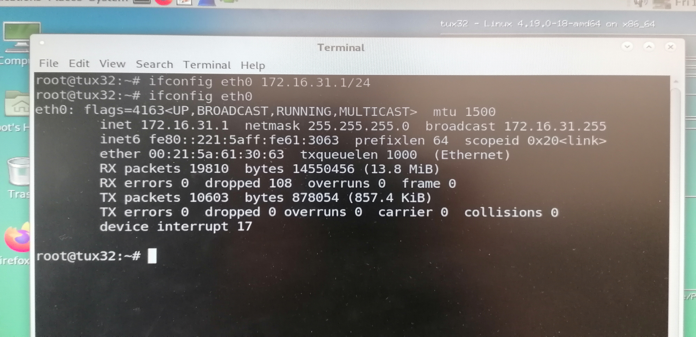

---

## Licenciatura em Engenharia Informática e Computação


---
# Redes de Computadores - Segundo Trabalho Laboratorial


#### **Contributors**

**Turma 10**

- [Tiago Lima Rocha](mailto:up201406679@edu.fe.up.pt) up201406679
- [Pedro Azevedo](mailto:up201603816@edu.fe.up.pt) up201603816
- [José Rodrigues](mailto:up201809590@edu.fc.up.pt) up201809590

## Índice

# Table of Contents 

- [Introdução](#introducao)
- [Arquitetura](#arquitetura)
- [Experiências](#experiencias)
    -  [Experiência 1](experiencia_1)
    -  [Experiência 2](experiencia_2)
    -  [Experiência 3](experiencia_3)
    -  [Experiência 4](experiencia_4)
- [Conclusão](#conclusao)


## Introdução

Este trabalho foi realizado no âmbito da cadeira de Redes de Computadores. O trabalho teve dois objetivos principais, o primeiro for o desenvolvimento de uma aplicação de download com FTP e o segundo objetivo foi a configuração de uma rede que seria utilizada para testar a aplicação. A configuração desta mesma rede consistiu configurar um router e um switch CISCO bem como as rotas nos diversos PC pertencentes a essa rede.

## Arquitetura

A nossa aplicação de download FTP tem como base uma arquitetura monolitica composta por 3 packages: 

### `api` 

Esta contem a logica para realizar downloads no modo `passive` a partir de métodos que obtêem a informacao do cliente, bem como o seu ip e port, efetuam uma conecção e descarregam o ficheiro. 

```c

/**
 * @brief parse the response from entering passive mode and save the info
 * 
 * @param client_info struct where the ip and port are saved
 * @param res response from the server
 * 
 * @return int 0 if success
 */
int pasv_get_client_info(client_info *client_info, const char *res);

/**
 * @brief build ip from where we will download the file 
 * 
 * @param client_ip ip built
 * @param client_info struct used to build the ip
 * 
 * @return int 0 if success
 */
int pasv_get_client_ip(char *client_ip, const client_info *client_info);


/**
 * @brief build the port where we will download the file from
 * 
 * @param client_info struct used to build the port
 * 
 * @return int 0 if success
 */
int pasv_get_client_port(const client_info * client_info);


/**
 * @brief logins user and sets the connection to passive mode
 * 
 * @param user_info contains the info to connect to the server
 * @param server_fd socket file descriptor to the server
 * @param client_ip ip used for downloading the file
 * 
 * @return int port for downloading the file
 */
int pasv_connect(user_info *user_info, int server_fd, char *client_ip);

/**
 * @brief Sends retrieve command to download the file
 * 
 * @param socket_fd socket file descriptor to send command
 * @param user_info not used
 * @return int 0 if success
 */
int pasv_retr(const int socket_fd, const user_info *user_info);

/**
 * @brief Downloads the file requested
 * 
 * @param user_info contains info about the ip and port to connect to server and download
 * @return int 0 if success
 */
int pasv_download(user_info *user_info);

```

### `lib`

Onde vivem as macros e a definição dos tipos, bem como helper methods úteis em várias secções do projeto. Neste estão definidas as estruturas mais importantes da nossa aplicação: **user_info**,**client_info**.

```c
struct client_info {
    int ip1;
    int ip2;
    int ip3;
    int ip4;
    int port1;
    int port2;
};

struct user_info
{
    char usr[BUFFER_SIZE];
    char pwd[BUFFER_SIZE];
    char host[BUFFER_SIZE];
    int port;
    char path[BUFFER_SIZE];
    char ip[BUFFER_SIZE];
    char f_name[BUFFER_SIZE];
    char hostname[BUFFER_SIZE];
};

```


### `middleware`

Este package serve como camada de ligação entre a nossa API e a API do servidor nela existem dois diretórios: `auth` que funciona como camada de autenticacao e autorizacao; e `connection` que contem as funcões que estabelecem e terminam uma nova ligação, enviam pedidos e recebem respostas. 

**Auth.h :**
```c
/**
 * @brief Logins into FTP server
 * 
 * @param socket_fd Socket to send info
 * @param user_info Contains user name and password
 * 
 * @return int 0 if success
 */
int auth_login(const int socket_fd, user_info *user_info);

/**
 * @brief Validate the response received 
 * 
 * @param res Response receive
 * @param code Code expected
 * 
 * @return int 0 if success -1 if not
 */
int auth_validate(char *res, const res_t code);

/**
 * @brief Reads the welcome message from FTP server
 * 
 * @param socket_fd Socket to read from
 */
void auth_welcome(const int socket_fd);

/**
 * @brief Sends a request to FTP server, reads response and validates response
 * 
 * @param user_info not used
 * @param cmd The command to send
 * @param cmd_len Length of the command
 * @param req_type Type of response expected
 * @param socket_fd Socket to send command and read response
 * 
 * @return char* returns response
 */
char *auth_request(user_info *user_info, const char *cmd, const size_t cmd_len, const res_t req_type, const int socket_fd);

```

**Connection.h :**
```c
/**
 * @brief Creates a socket with the specified ip and port
 * 
 * @param ip Specified Ip
 * @param port Specified Port
 * 
 * @return int socket descriptor if success
 */
int init_connection(char *ip, int port);

/**
 * @brief Sends a command through socket 
 * 
 * @param cmd The command to send
 * @param cmd_len Lenght of the command to send
 * @param socket_fd The socket to send the command through
 * 
 * @return int 0 if success -1 if not
 */
int send_req(const char * cmd, const size_t cmd_len, const int socket_fd);

/**
 * @brief Reads response after send command
 * 
 * @param socket_fd Socket to read the response from
 * @param res Response received
 * 
 * @return int 0 if success -1 if not
 */
int read_res(const int socket_fd, char *res);

/**
 * @brief Closes a connection
 * 
 * @return int 0 if success -1 if not
 */
int close_connection();
```

#### Utilizacao:

`$ ftp://[<user>:<password>@]<host>/<url-path> -[mode]`
  
*Options:*
-A: Active mode
-P: Passive mode

*Example:* 

`$ ./download ftp://ftp.up.pt/pub/kodi/timestamp.txt -A`

*Note:* The server is in the lab, to access it you need to be connected through the FEUP VPN.

## Experiências

### Experiência 1

Nesta experiência foi nos pedido para connectar 2 dois PC usando um switch e configurando os IP address de ambos. As perguntas que nos foram feitas para responder foram as seguintes:

1) O que é que são ARP packets e para que servem?

    ARP(Address Resolution Packets) como o próprio nome indica serve para resolver endereços na camada de ligação. Também serve para mapear um endereço IPv4 a um endereço físico com endereço MAC ou Ethernet.

2) Quais são os MAC e IP addresses do ARP packets e porquẽ?

    No caso do tux 4 os MAC e IP addresses do ARP packets são:

        - IP : 172.16.30.254
        - MAC : 00:21:5a:5a:7d:74

    No caso do tux 3 os MAC e IP addresses do ARP packets são:

        - IP: 172.16.30.1
        - MAC: 00:21:5a:61:24:92

    Quando damos ping de um tux para o outro o tux inicialmente manda um request para o IP especificado no qual quer saber o MAC address dessa mesma máquina. Por sua vez o tux a qual foi feito o pedido responde com um packet ARP no qual indica qual o MAC address requesitado que irá depois ser guardado em cache.

3) Que tipo de packets é que o comando ping gera?

    Inicialmente gera pacotes de ARP e em seguida gera packotes ICMP(Internet Control Message Protocol).

4) Quais os MAC e IP address dos packets gerados pelo ping?

    Os IP e MAC addresses gerados pelo ping request:

        - MAC e IP Origem: Tux que realizou o comando ping
        - MAC e IP Destino: O Tux alvo do pedido

    Os IP e MAC addresses gerados pelo ping response:

        - MAC e IP Origem: O Tux que recebeu o request
        - MAC e IP Destino: O Tux que iniciou o request

5) Como determinar se uma Ethernet frame is ARP,IP,ICMP ?

    Para determinar se um Ethernet Frame é ARP,IP,ICMP é nessário inspecionar o cabeçalho da Frame.

6) Como determinar o tamanho de uma frame recebida?

    Usando o wireshark é possível determinar o tamanho de packet inspecionado-o.

7) Qual o loopback interface e porque é que é importante?

    A interface de loopback permite ao computador fazer testes de diagnóstico da infraestrutura de transmissão e de transporte, isto é usada para confirmar se a carta de rede está configurada corretamente.

### Experiência 2

O objetivo desta experiência foi configurar 2 VLANs na Switch. Para isso foi nos pedidos para responder ás seguintes perguntas:

1) Como configurar a vlan30?

    Para configurar a vlan30 é necessário:

    - Criar a VLAN 30 no Switch
    
    ```bash=
    >configure terminal
        >vlan 30
        >end
    ```

    - Associar as portas que o Tux3 e do Tux4 estão ligados no switch á Vlan 30, neste caso o Tux 3 está associado á porta de 2 e o Tux 4 está associado á porta 1. 

    ```bash=
    >configure terminal
        >interface fastethernet 0/1
        >switchport mode access
        >switchport access vlan 30
        >end

    >configure terminal
        >interface fastethernet 0/2
        >switchport mode access
        >switchport access vlan 30
        >end
    ```

2) Quantos broadcast domains existem? Como conseguimos concluir a partir dos logs?

    O tux 3 e o tux 4 quando dão ping eles recebem packets um do outro mas não recebem nenhum packet do tux 2 e o tux 2 não recebe nenhum packet do tux 3 e do tux 4. Por isso podemos concluir que existem 2 broadcast domains um com o tux 2 e outro com o tux 3 e o tux 4.

### Experiência 3

Nesta experiência foi nos pedido para analisar um ficheiro de configuração de um Router, testar entradas de DNS e configurar rotas numa máquina local. Para isso foi nos pedido para responder ás seguintes perguntas:

1) Como configurar a rota estática num router comercial?

    Para configurar a rota estática num router comercial é necessário, correr os seguintes comandos na consola do router:

    ```bash=
    > configure terminal
        > ip route [destino] [máscara] [gateway]
        > exit
    ```

2) Como configurar o NAT num router comercial?

    Para configurar o NAT num router comercial é necessário correr os seguintes comandos na consola do router:

    ```bash=
    conf t 
        interface gigabitethernet 0/0 * 
            ip address 172.16.y1.254 255.255.255.0 
            no shutdown 
            ip nat inside 
            exit 
        interface gigabitethernet 0/1* 
            ip address 172.16.1.y9 255.255.255.0 
            no shutdown 
            ip nat outside 
            exit 
        ip nat pool ovrld 172.16.1.y9 172.16.1.y9 prefix 24 
        ip nat inside source list 1 pool ovrld overload 
        access-list 1 permit 172.16.y0.0 0.0.0.7 
        access-list 1 permit 172.16.y1.0 0.0.0.7 
        ip route 0.0.0.0 0.0.0.0 172.16.1.254 
        ip route 172.16.y0.0 255.255.255.0 172.16.y1.253 
        end
    ```


3) O que é que faz o NAT?

    O NAT(Network Address Translation) é uma técnica que permite reescrever os endereços de IP de origem de forma a que um computador numa rede interna tenha acesso ao exterior, isto é o router faz a tradução de endereços IP não registados possam aceder à Internet ou rede pública. 

4) Como configurar o serviço de DNS no host?

    Para configurar o serviço de DNS no host é necessário alterar o ficheiro etc/resolv.conf no caso desta experiência foi adicionado :

    ```bash=
    nameserver 9.9.9.9
    ```

5) Que pacotes são trocados pelo DNS e que informação transportam?

    Numa fase inicial o host manda um packet a perguntar qual o IP de do hostname desejado, em seguida deve receber uma resposta do servidor com IP do hostname.

6) Que packets ICMP são observados e porquê?

    São observados packets ICMP de request/reply uma vez que adicionada um rota o computador deve ser capaz de contactar com a rota adicionada. Se não é enviado Host Unreachable .
    
7) Quais os IP e MAC addresses associados ao ICMP e porquê?

    Os IP e MAC addresses associados são os IP e MAC addresses do computador que realiza o request e o destino para o request é feito (Isto é o IP e o MAC do hostname adicionado).

8) Que rotas existiam na maquina? Qual o seu significado?

    Na tabela de rotas apenas existia a default gateway do computador, que serve de ponto de acesso a outras redes.


### Experiência 4

Nesta experiência foi a aplicação da configuração testada na experiência 3 com base na experiência 2, isto é configuração do Switch e do Router. 

Para esta experiência alguns dos log não foram possíveis de capturar uma vez que foi dado prioridade em por a rede criada a funcionar para a demonstração por isso as perguntas irão ser respondidas sem accesso a logs mas com base do que foi feito e também de alguma pesquisa, assim as respostas ás seguintes perguntas são:

1) Que rotas estavam nos Tuxes e o que é que significam?

    As rotas presentes no Tux3: tinha uma rota para aceder ao Tux2 através do Tux4 e a default gateway do Tux3.

    As rotas presentes no Tux2: tinha uma rota para aceder ao Tux3 através do Tux4 e a default gateway do Tux2.

    Isto permite ao tuxes saber para onde deve enviar pacotes quando tem como destino um dos Tuxes e parte do oposto (Ex.: tux3 -> tux4 -> tux2). 
     

2) Que informação uma entrada da fowarding table contêm?

    Uma entrada da forwarding table mostra:

        - Destino da entrada
        - A Gateway
        - A mask do Destino
        - As flags da rota (U->up, G->gateway, H->host, etc...)
        - A metric (distância ao alvo)
        - Ref (número de referências a esta rota)
        - Use (número de lookups para uma rota)
        - Iface (Interface para qual os pacotes da rota irão ser enviados)

3) Que mensagens ARP e MAC addresses associados são observados e porquê?

    Como não fizemos a captura supômos que quando o Tux3 realizava o ping para cada uma das interfaces as mensagens de ARP que enviava tinham sempre como MAC address o da gateway e não a do destino final uma vez que é a gateway que teria de reencaminhar as mensagens recebidas.

4) Quais os IP e MAC addresses associados a ICMP packets e porquê?

    Como não fizemos a captura supômos que o endereço IP e MAC associados aos ICMP packets quando damos ping do Tux3 para o Tux2, o endereço MAC e IP de destino quando é enviado um request do Tux3 para o Tux2 mostra os MAC e IP do Tux4 e quando é enviado um reply do Tux2 para Tux3 o IP e MAC de origem são os do Tux4.

5) Quais os caminhos seguidos pelos packets nas experiências realizadas e porquê?

    Uma vez que não foi feita a captura não podemos responder com toda a certeza, no entanto supômos que quando é feito um ping do router para todos os tuxes poderêmos verifica que o para o o tux2 e 4 os packets são diretos uma vez que têm rota direta para o router, quanto ao tux 3 os packets tem de passar pelo o tux4 primeiro uma vez que este não têm rota direta. 


## Conclusão

Este trabalho alcançou os dois objetivos principais, com a aplicação de download com FTP e a configuração de uma rede para testar a aplicação.

O cliente FTP foi implementado com sucesso, e é capaz de transferir diferentes ficheiros com tamanhos diferentes. Com o desenvolvimento deste programa, nós percebemos melhor este protocolo e como um protocolo oficial funciona, comparando com o que foi feito.

A configuração da rede foi concluída com sucesso, apesar de em alguns casos não ter-mos sido capazes de fazer a captura de tudo o que nos foi pedido, permitiu-nos perceber, num nível mais aprofundado, como uma rede funciona e como configurá-la.

Os objetivos dos guiões laboratoriais foram atingidos, e deixou-nos com uma perspetiva diferente do funcionamento de como as redes de computadores funcionam.

## Anexos


Fig1 : IP and MAC do Tux3


Fig2 : IP and MAC do Tux4


Fig3 : ARP do Tux3


Fig4 : ARP do Tux4


Ping Tux3 to Tux4:

```bash
"No.","Time","Source","Destination","Protocol","Length","Info"
"1","0.000000000","Cisco_3a:fa:8a","Spanning-tree-(for-bridges)_00","STP","60","Conf. Root = 32768/1/fc:fb:fb:3a:fa:80  Cost = 0  Port = 0x800a"
"2","1.896004082","Cisco_3a:fa:8a","Cisco_3a:fa:8a","LOOP","60","Reply"
"3","2.005054955","Cisco_3a:fa:8a","Spanning-tree-(for-bridges)_00","STP","60","Conf. Root = 32768/1/fc:fb:fb:3a:fa:80  Cost = 0  Port = 0x800a"
"4","2.482893011","Cisco_3a:fa:8a","CDP/VTP/DTP/PAgP/UDLD","DTP","60","Dynamic Trunk Protocol"
"5","2.482995677","Cisco_3a:fa:8a","CDP/VTP/DTP/PAgP/UDLD","DTP","90","Dynamic Trunk Protocol"
"6","4.009755255","Cisco_3a:fa:8a","Spanning-tree-(for-bridges)_00","STP","60","Conf. Root = 32768/1/fc:fb:fb:3a:fa:80  Cost = 0  Port = 0x800a"
"7","6.014766280","Cisco_3a:fa:8a","Spanning-tree-(for-bridges)_00","STP","60","Conf. Root = 32768/1/fc:fb:fb:3a:fa:80  Cost = 0  Port = 0x800a"
"8","8.019801261","Cisco_3a:fa:8a","Spanning-tree-(for-bridges)_00","STP","60","Conf. Root = 32768/1/fc:fb:fb:3a:fa:80  Cost = 0  Port = 0x800a"
"9","10.024437097","Cisco_3a:fa:8a","Spanning-tree-(for-bridges)_00","STP","60","Conf. Root = 32768/1/fc:fb:fb:3a:fa:80  Cost = 0  Port = 0x800a"
"10","11.903677843","Cisco_3a:fa:8a","Cisco_3a:fa:8a","LOOP","60","Reply"
"11","12.029404611","Cisco_3a:fa:8a","Spanning-tree-(for-bridges)_00","STP","60","Conf. Root = 32768/1/fc:fb:fb:3a:fa:80  Cost = 0  Port = 0x800a"
"12","14.034372264","Cisco_3a:fa:8a","Spanning-tree-(for-bridges)_00","STP","60","Conf. Root = 32768/1/fc:fb:fb:3a:fa:80  Cost = 0  Port = 0x800a"
"13","15.219489783","HewlettP_5a:7d:74","Broadcast","ARP","42","Who has 172.16.30.1? Tell 172.16.30.254"
"14","15.219627301","HewlettP_61:24:92","HewlettP_5a:7d:74","ARP","60","172.16.30.1 is at 00:21:5a:61:24:92"
"15","15.219645250","172.16.30.254","172.16.30.1","ICMP","98","Echo (ping) request  id=0x36a4, seq=1/256, ttl=64 (reply in 16)"
"16","15.219810844","172.16.30.1","172.16.30.254","ICMP","98","Echo (ping) reply    id=0x36a4, seq=1/256, ttl=64 (request in 15)"
"17","16.039206381","Cisco_3a:fa:8a","Spanning-tree-(for-bridges)_00","STP","60","Conf. Root = 32768/1/fc:fb:fb:3a:fa:80  Cost = 0  Port = 0x800a"
"18","16.227336383","172.16.30.254","172.16.30.1","ICMP","98","Echo (ping) request  id=0x36a4, seq=2/512, ttl=64 (reply in 19)"
"19","16.227480605","172.16.30.1","172.16.30.254","ICMP","98","Echo (ping) reply    id=0x36a4, seq=2/512, ttl=64 (request in 18)"
"20","17.213653808","Cisco_3a:fa:8a","CDP/VTP/DTP/PAgP/UDLD","CDP","453","Device ID: tux-sw3  Port ID: FastEthernet0/8  "
"21","17.251406165","172.16.30.254","172.16.30.1","ICMP","98","Echo (ping) request  id=0x36a4, seq=3/768, ttl=64 (reply in 22)"
"22","17.251586496","172.16.30.1","172.16.30.254","ICMP","98","Echo (ping) reply    id=0x36a4, seq=3/768, ttl=64 (request in 21)"
"23","18.043990910","Cisco_3a:fa:8a","Spanning-tree-(for-bridges)_00","STP","60","Conf. Root = 32768/1/fc:fb:fb:3a:fa:80  Cost = 0  Port = 0x800a"
"24","18.275345973","172.16.30.254","172.16.30.1","ICMP","98","Echo (ping) request  id=0x36a4, seq=4/1024, ttl=64 (reply in 25)"
"25","18.275503186","172.16.30.1","172.16.30.254","ICMP","98","Echo (ping) reply    id=0x36a4, seq=4/1024, ttl=64 (request in 24)"
"26","19.299342142","172.16.30.254","172.16.30.1","ICMP","98","Echo (ping) request  id=0x36a4, seq=5/1280, ttl=64 (reply in 27)"
"27","19.299496073","172.16.30.1","172.16.30.254","ICMP","98","Echo (ping) reply    id=0x36a4, seq=5/1280, ttl=64 (request in 26)"
"28","20.048921198","Cisco_3a:fa:8a","Spanning-tree-(for-bridges)_00","STP","60","Conf. Root = 32768/1/fc:fb:fb:3a:fa:80  Cost = 0  Port = 0x800a"
"29","20.321150599","HewlettP_61:24:92","HewlettP_5a:7d:74","ARP","60","Who has 172.16.30.254? Tell 172.16.30.1"
"30","20.321172041","HewlettP_5a:7d:74","HewlettP_61:24:92","ARP","42","172.16.30.254 is at 00:21:5a:5a:7d:74"
"31","20.323332445","172.16.30.254","172.16.30.1","ICMP","98","Echo (ping) request  id=0x36a4, seq=6/1536, ttl=64 (reply in 32)"
"32","20.323468147","172.16.30.1","172.16.30.254","ICMP","98","Echo (ping) reply    id=0x36a4, seq=6/1536, ttl=64 (request in 31)"
"33","21.347339440","172.16.30.254","172.16.30.1","ICMP","98","Echo (ping) request  id=0x36a4, seq=7/1792, ttl=64 (reply in 34)"
"34","21.347522285","172.16.30.1","172.16.30.254","ICMP","98","Echo (ping) reply    id=0x36a4, seq=7/1792, ttl=64 (request in 33)"
"35","21.903011911","Cisco_3a:fa:8a","Cisco_3a:fa:8a","LOOP","60","Reply"
"36","22.053761391","Cisco_3a:fa:8a","Spanning-tree-(for-bridges)_00","STP","60","Conf. Root = 32768/1/fc:fb:fb:3a:fa:80  Cost = 0  Port = 0x800a"
"37","22.371338473","172.16.30.254","172.16.30.1","ICMP","98","Echo (ping) request  id=0x36a4, seq=8/2048, ttl=64 (reply in 38)"
"38","22.371480880","172.16.30.1","172.16.30.254","ICMP","98","Echo (ping) reply    id=0x36a4, seq=8/2048, ttl=64 (request in 37)"
"39","23.395336738","172.16.30.254","172.16.30.1","ICMP","98","Echo (ping) request  id=0x36a4, seq=9/2304, ttl=64 (reply in 40)"
"40","23.395514834","172.16.30.1","172.16.30.254","ICMP","98","Echo (ping) reply    id=0x36a4, seq=9/2304, ttl=64 (request in 39)"
"41","24.058652358","Cisco_3a:fa:8a","Spanning-tree-(for-bridges)_00","STP","60","Conf. Root = 32768/1/fc:fb:fb:3a:fa:80  Cost = 0  Port = 0x800a"
"42","24.419340660","172.16.30.254","172.16.30.1","ICMP","98","Echo (ping) request  id=0x36a4, seq=10/2560, ttl=64 (reply in 43)"
"43","24.419506463","172.16.30.1","172.16.30.254","ICMP","98","Echo (ping) reply    id=0x36a4, seq=10/2560, ttl=64 (request in 42)"
"44","25.443340950","172.16.30.254","172.16.30.1","ICMP","98","Echo (ping) request  id=0x36a4, seq=11/2816, ttl=64 (reply in 45)"
"45","25.443492157","172.16.30.1","172.16.30.254","ICMP","98","Echo (ping) reply    id=0x36a4, seq=11/2816, ttl=64 (request in 44)"
"46","26.063908177","Cisco_3a:fa:8a","Spanning-tree-(for-bridges)_00","STP","60","Conf. Root = 32768/1/fc:fb:fb:3a:fa:80  Cost = 0  Port = 0x800a"
"47","26.467337748","172.16.30.254","172.16.30.1","ICMP","98","Echo (ping) request  id=0x36a4, seq=12/3072, ttl=64 (reply in 48)"
"48","26.467527577","172.16.30.1","172.16.30.254","ICMP","98","Echo (ping) reply    id=0x36a4, seq=12/3072, ttl=64 (request in 47)"
"49","27.491346769","172.16.30.254","172.16.30.1","ICMP","98","Echo (ping) request  id=0x36a4, seq=13/3328, ttl=64 (reply in 50)"
"50","27.491498534","172.16.30.1","172.16.30.254","ICMP","98","Echo (ping) reply    id=0x36a4, seq=13/3328, ttl=64 (request in 49)"
"51","28.068404121","Cisco_3a:fa:8a","Spanning-tree-(for-bridges)_00","STP","60","Conf. Root = 32768/1/fc:fb:fb:3a:fa:80  Cost = 0  Port = 0x800a"
"52","28.515341960","172.16.30.254","172.16.30.1","ICMP","98","Echo (ping) request  id=0x36a4, seq=14/3584, ttl=64 (reply in 53)"
"53","28.515500361","172.16.30.1","172.16.30.254","ICMP","98","Echo (ping) reply    id=0x36a4, seq=14/3584, ttl=64 (request in 52)"
"54","30.073771128","Cisco_3a:fa:8a","Spanning-tree-(for-bridges)_00","STP","60","Conf. Root = 32768/1/fc:fb:fb:3a:fa:80  Cost = 0  Port = 0x800a"
"55","31.910604097","Cisco_3a:fa:8a","Cisco_3a:fa:8a","LOOP","60","Reply"
"56","32.078269866","Cisco_3a:fa:8a","Spanning-tree-(for-bridges)_00","STP","60","Conf. Root = 32768/1/fc:fb:fb:3a:fa:80  Cost = 0  Port = 0x800a"
"57","32.502549614","Cisco_3a:fa:8a","CDP/VTP/DTP/PAgP/UDLD","DTP","60","Dynamic Trunk Protocol"
"58","32.502747055","Cisco_3a:fa:8a","CDP/VTP/DTP/PAgP/UDLD","DTP","90","Dynamic Trunk Protocol"
"59","34.083380066","Cisco_3a:fa:8a","Spanning-tree-(for-bridges)_00","STP","60","Conf. Root = 32768/1/fc:fb:fb:3a:fa:80  Cost = 0  Port = 0x800a"
"60","36.087988036","Cisco_3a:fa:8a","Spanning-tree-(for-bridges)_00","STP","60","Conf. Root = 32768/1/fc:fb:fb:3a:fa:80  Cost = 0  Port = 0x800a"
"61","38.092965117","Cisco_3a:fa:8a","Spanning-tree-(for-bridges)_00","STP","60","Conf. Root = 32768/1/fc:fb:fb:3a:fa:80  Cost = 0  Port = 0x800a"
"62","40.098120365","Cisco_3a:fa:8a","Spanning-tree-(for-bridges)_00","STP","60","Conf. Root = 32768/1/fc:fb:fb:3a:fa:80  Cost = 0  Port = 0x800a"
"63","41.923421259","Cisco_3a:fa:8a","Cisco_3a:fa:8a","LOOP","60","Reply"
"64","42.102636633","Cisco_3a:fa:8a","Spanning-tree-(for-bridges)_00","STP","60","Conf. Root = 32768/1/fc:fb:fb:3a:fa:80  Cost = 0  Port = 0x800a"
"65","42.668016920","fe80::221:5aff:fe5a:7d74","ff02::fb","MDNS","180","Standard query 0x0000 PTR _nfs._tcp.local, ""QM"" question PTR _ftp._tcp.local, ""QM"" question PTR _webdav._tcp.local, ""QM"" question PTR _webdavs._tcp.local, ""QM"" question PTR _sftp-ssh._tcp.local, ""QM"" question PTR _smb._tcp.local, ""QM"" question PTR _afpovertcp._tcp.local, ""QM"" question"
"66","44.107541359","Cisco_3a:fa:8a","Spanning-tree-(for-bridges)_00","STP","60","Conf. Root = 32768/1/fc:fb:fb:3a:fa:80  Cost = 0  Port = 0x800a"
"67","46.112416682","Cisco_3a:fa:8a","Spanning-tree-(for-bridges)_00","STP","60","Conf. Root = 32768/1/fc:fb:fb:3a:fa:80  Cost = 0  Port = 0x800a"
"68","48.117306462","Cisco_3a:fa:8a","Spanning-tree-(for-bridges)_00","STP","60","Conf. Root = 32768/1/fc:fb:fb:3a:fa:80  Cost = 0  Port = 0x800a"
"69","50.122200782","Cisco_3a:fa:8a","Spanning-tree-(for-bridges)_00","STP","60","Conf. Root = 32768/1/fc:fb:fb:3a:fa:80  Cost = 0  Port = 0x800a"
"70","51.931064779","Cisco_3a:fa:8a","Cisco_3a:fa:8a","LOOP","60","Reply"
"71","52.127065070","Cisco_3a:fa:8a","Spanning-tree-(for-bridges)_00","STP","60","Conf. Root = 32768/1/fc:fb:fb:3a:fa:80  Cost = 0  Port = 0x800a"
"72","54.131973567","Cisco_3a:fa:8a","Spanning-tree-(for-bridges)_00","STP","60","Conf. Root = 32768/1/fc:fb:fb:3a:fa:80  Cost = 0  Port = 0x800a"
"73","56.137013856","Cisco_3a:fa:8a","Spanning-tree-(for-bridges)_00","STP","60","Conf. Root = 32768/1/fc:fb:fb:3a:fa:80  Cost = 0  Port = 0x800a"
"74","58.141737972","Cisco_3a:fa:8a","Spanning-tree-(for-bridges)_00","STP","60","Conf. Root = 32768/1/fc:fb:fb:3a:fa:80  Cost = 0  Port = 0x800a"
"75","60.146654641","Cisco_3a:fa:8a","Spanning-tree-(for-bridges)_00","STP","60","Conf. Root = 32768/1/fc:fb:fb:3a:fa:80  Cost = 0  Port = 0x800a"
"76","61.925544589","Cisco_3a:fa:8a","Cisco_3a:fa:8a","LOOP","60","Reply"
"77","62.152027794","Cisco_3a:fa:8a","Spanning-tree-(for-bridges)_00","STP","60","Conf. Root = 32768/1/fc:fb:fb:3a:fa:80  Cost = 0  Port = 0x800a"
"78","62.503712140","Cisco_3a:fa:8a","CDP/VTP/DTP/PAgP/UDLD","DTP","60","Dynamic Trunk Protocol"
"79","62.503806636","Cisco_3a:fa:8a","CDP/VTP/DTP/PAgP/UDLD","DTP","90","Dynamic Trunk Protocol"
"80","64.156569275","Cisco_3a:fa:8a","Spanning-tree-(for-bridges)_00","STP","60","Conf. Root = 32768/1/fc:fb:fb:3a:fa:80  Cost = 0  Port = 0x800a"
"81","66.161337251","Cisco_3a:fa:8a","Spanning-tree-(for-bridges)_00","STP","60","Conf. Root = 32768/1/fc:fb:fb:3a:fa:80  Cost = 0  Port = 0x800a"
"82","68.166365038","Cisco_3a:fa:8a","Spanning-tree-(for-bridges)_00","STP","60","Conf. Root = 32768/1/fc:fb:fb:3a:fa:80  Cost = 0  Port = 0x800a"
"83","70.171341002","Cisco_3a:fa:8a","Spanning-tree-(for-bridges)_00","STP","60","Conf. Root = 32768/1/fc:fb:fb:3a:fa:80  Cost = 0  Port = 0x800a"
"84","71.932879130","Cisco_3a:fa:8a","Cisco_3a:fa:8a","LOOP","60","Reply"
"85","72.175955538","Cisco_3a:fa:8a","Spanning-tree-(for-bridges)_00","STP","60","Conf. Root = 32768/1/fc:fb:fb:3a:fa:80  Cost = 0  Port = 0x800a"
"86","74.186365024","Cisco_3a:fa:8a","Spanning-tree-(for-bridges)_00","STP","60","Conf. Root = 32768/1/fc:fb:fb:3a:fa:80  Cost = 0  Port = 0x800a"
"87","76.185726437","Cisco_3a:fa:8a","Spanning-tree-(for-bridges)_00","STP","60","Conf. Root = 32768/1/fc:fb:fb:3a:fa:80  Cost = 0  Port = 0x800a"
"88","77.217671468","Cisco_3a:fa:8a","CDP/VTP/DTP/PAgP/UDLD","CDP","453","Device ID: tux-sw3  Port ID: FastEthernet0/8  "
"89","78.190732503","Cisco_3a:fa:8a","Spanning-tree-(for-bridges)_00","STP","60","Conf. Root = 32768/1/fc:fb:fb:3a:fa:80  Cost = 0  Port = 0x800a"
"90","80.195506556","Cisco_3a:fa:8a","Spanning-tree-(for-bridges)_00","STP","60","Conf. Root = 32768/1/fc:fb:fb:3a:fa:80  Cost = 0  Port = 0x800a"
"91","81.940544440","Cisco_3a:fa:8a","Cisco_3a:fa:8a","LOOP","60","Reply"
"92","82.200544959","Cisco_3a:fa:8a","Spanning-tree-(for-bridges)_00","STP","60","Conf. Root = 32768/1/fc:fb:fb:3a:fa:80  Cost = 0  Port = 0x800a"
"93","84.205384523","Cisco_3a:fa:8a","Spanning-tree-(for-bridges)_00","STP","60","Conf. Root = 32768/1/fc:fb:fb:3a:fa:80  Cost = 0  Port = 0x800a"
"94","86.210180646","Cisco_3a:fa:8a","Spanning-tree-(for-bridges)_00","STP","60","Conf. Root = 32768/1/fc:fb:fb:3a:fa:80  Cost = 0  Port = 0x800a"
"95","88.215334007","Cisco_3a:fa:8a","Spanning-tree-(for-bridges)_00","STP","60","Conf. Root = 32768/1/fc:fb:fb:3a:fa:80  Cost = 0  Port = 0x800a"
"96","90.219941489","Cisco_3a:fa:8a","Spanning-tree-(for-bridges)_00","STP","60","Conf. Root = 32768/1/fc:fb:fb:3a:fa:80  Cost = 0  Port = 0x800a"
"97","91.948222461","Cisco_3a:fa:8a","Cisco_3a:fa:8a","LOOP","60","Reply"
"98","92.224915218","Cisco_3a:fa:8a","Spanning-tree-(for-bridges)_00","STP","60","Conf. Root = 32768/1/fc:fb:fb:3a:fa:80  Cost = 0  Port = 0x800a"
"99","92.514943913","Cisco_3a:fa:8a","CDP/VTP/DTP/PAgP/UDLD","DTP","60","Dynamic Trunk Protocol"
... (115 lines left)
```



Fig5 : IP e MAC do Tux2


Fig6 : Rotas do Tux3


Fig7 : Rotas do Tux4

Ping Tux2 from Tux3:

```bash
"No.","Time","Source","Destination","Protocol","Length","Info"
"1","0.000000000","Cisco_3a:fa:86","Spanning-tree-(for-bridges)_00","STP","60","Conf. Root = 32768/30/fc:fb:fb:3a:fa:80  Cost = 0  Port = 0x8006"
"2","1.367679228","Cisco_3a:fa:86","CDP/VTP/DTP/PAgP/UDLD","CDP","435","Device ID: tux-sw3  Port ID: FastEthernet0/4  "
"3","2.004896652","Cisco_3a:fa:86","Spanning-tree-(for-bridges)_00","STP","60","Conf. Root = 32768/30/fc:fb:fb:3a:fa:80  Cost = 0  Port = 0x8006"
"4","3.825364800","Cisco_3a:fa:86","Cisco_3a:fa:86","LOOP","60","Reply"
"5","4.009777938","Cisco_3a:fa:86","Spanning-tree-(for-bridges)_00","STP","60","Conf. Root = 32768/30/fc:fb:fb:3a:fa:80  Cost = 0  Port = 0x8006"
"6","6.019806340","Cisco_3a:fa:86","Spanning-tree-(for-bridges)_00","STP","60","Conf. Root = 32768/30/fc:fb:fb:3a:fa:80  Cost = 0  Port = 0x8006"
"7","8.019534855","Cisco_3a:fa:86","Spanning-tree-(for-bridges)_00","STP","60","Conf. Root = 32768/30/fc:fb:fb:3a:fa:80  Cost = 0  Port = 0x8006"
"8","10.024500999","Cisco_3a:fa:86","Spanning-tree-(for-bridges)_00","STP","60","Conf. Root = 32768/30/fc:fb:fb:3a:fa:80  Cost = 0  Port = 0x8006"
"9","12.037291706","Cisco_3a:fa:86","Spanning-tree-(for-bridges)_00","STP","60","Conf. Root = 32768/30/fc:fb:fb:3a:fa:80  Cost = 0  Port = 0x8006"
"10","13.838101334","Cisco_3a:fa:86","Cisco_3a:fa:86","LOOP","60","Reply"
"11","14.053254407","Cisco_3a:fa:86","Spanning-tree-(for-bridges)_00","STP","60","Conf. Root = 32768/30/fc:fb:fb:3a:fa:80  Cost = 0  Port = 0x8006"
"12","16.055849360","Cisco_3a:fa:86","Spanning-tree-(for-bridges)_00","STP","60","Conf. Root = 32768/30/fc:fb:fb:3a:fa:80  Cost = 0  Port = 0x8006"
"13","18.060760329","Cisco_3a:fa:86","Spanning-tree-(for-bridges)_00","STP","60","Conf. Root = 32768/30/fc:fb:fb:3a:fa:80  Cost = 0  Port = 0x8006"
"14","20.070668883","Cisco_3a:fa:86","Spanning-tree-(for-bridges)_00","STP","60","Conf. Root = 32768/30/fc:fb:fb:3a:fa:80  Cost = 0  Port = 0x8006"
"15","22.070538827","Cisco_3a:fa:86","Spanning-tree-(for-bridges)_00","STP","60","Conf. Root = 32768/30/fc:fb:fb:3a:fa:80  Cost = 0  Port = 0x8006"
"16","23.832358134","Cisco_3a:fa:86","Cisco_3a:fa:86","LOOP","60","Reply"
"17","24.075397625","Cisco_3a:fa:86","Spanning-tree-(for-bridges)_00","STP","60","Conf. Root = 32768/30/fc:fb:fb:3a:fa:80  Cost = 0  Port = 0x8006"
"18","26.085390547","Cisco_3a:fa:86","Spanning-tree-(for-bridges)_00","STP","60","Conf. Root = 32768/30/fc:fb:fb:3a:fa:80  Cost = 0  Port = 0x8006"
"19","28.085246452","Cisco_3a:fa:86","Spanning-tree-(for-bridges)_00","STP","60","Conf. Root = 32768/30/fc:fb:fb:3a:fa:80  Cost = 0  Port = 0x8006"
"20","30.090061250","Cisco_3a:fa:86","Spanning-tree-(for-bridges)_00","STP","60","Conf. Root = 32768/30/fc:fb:fb:3a:fa:80  Cost = 0  Port = 0x8006"
"21","32.099997740","Cisco_3a:fa:86","Spanning-tree-(for-bridges)_00","STP","60","Conf. Root = 32768/30/fc:fb:fb:3a:fa:80  Cost = 0  Port = 0x8006"
"22","33.840018163","Cisco_3a:fa:86","Cisco_3a:fa:86","LOOP","60","Reply"
"23","34.099815303","Cisco_3a:fa:86","Spanning-tree-(for-bridges)_00","STP","60","Conf. Root = 32768/30/fc:fb:fb:3a:fa:80  Cost = 0  Port = 0x8006"
"24","36.104706577","Cisco_3a:fa:86","Spanning-tree-(for-bridges)_00","STP","60","Conf. Root = 32768/30/fc:fb:fb:3a:fa:80  Cost = 0  Port = 0x8006"
"25","38.114653125","Cisco_3a:fa:86","Spanning-tree-(for-bridges)_00","STP","60","Conf. Root = 32768/30/fc:fb:fb:3a:fa:80  Cost = 0  Port = 0x8006"
```

Ping Tux4 from Tux3:

```bash
"No.","Time","Source","Destination","Protocol","Length","Info"
"1","0.000000000","Cisco_3a:fa:86","Spanning-tree-(for-bridges)_00","STP","60","Conf. Root = 32768/30/fc:fb:fb:3a:fa:80  Cost = 0  Port = 0x8006"
"2","1.999808204","Cisco_3a:fa:86","Spanning-tree-(for-bridges)_00","STP","60","Conf. Root = 32768/30/fc:fb:fb:3a:fa:80  Cost = 0  Port = 0x8006"
"3","4.004683484","Cisco_3a:fa:86","Spanning-tree-(for-bridges)_00","STP","60","Conf. Root = 32768/30/fc:fb:fb:3a:fa:80  Cost = 0  Port = 0x8006"
"4","6.001421242","Cisco_3a:fa:86","Cisco_3a:fa:86","LOOP","60","Reply"
"5","6.014785359","Cisco_3a:fa:86","Spanning-tree-(for-bridges)_00","STP","60","Conf. Root = 32768/30/fc:fb:fb:3a:fa:80  Cost = 0  Port = 0x8006"
"6","8.014503886","Cisco_3a:fa:86","Spanning-tree-(for-bridges)_00","STP","60","Conf. Root = 32768/30/fc:fb:fb:3a:fa:80  Cost = 0  Port = 0x8006"
"7","10.019414367","Cisco_3a:fa:86","Spanning-tree-(for-bridges)_00","STP","60","Conf. Root = 32768/30/fc:fb:fb:3a:fa:80  Cost = 0  Port = 0x8006"
"8","11.533716151","172.16.30.1","172.16.30.254","ICMP","98","Echo (ping) request  id=0x0e6e, seq=1/256, ttl=64 (reply in 9)"
"9","11.533881885","172.16.30.254","172.16.30.1","ICMP","98","Echo (ping) reply    id=0x0e6e, seq=1/256, ttl=64 (request in 8)"
"10","12.029386337","Cisco_3a:fa:86","Spanning-tree-(for-bridges)_00","STP","60","Conf. Root = 32768/30/fc:fb:fb:3a:fa:80  Cost = 0  Port = 0x8006"
"11","12.554367359","172.16.30.1","172.16.30.254","ICMP","98","Echo (ping) request  id=0x0e6e, seq=2/512, ttl=64 (reply in 12)"
"12","12.554532883","172.16.30.254","172.16.30.1","ICMP","98","Echo (ping) reply    id=0x0e6e, seq=2/512, ttl=64 (request in 11)"
"13","13.578374455","172.16.30.1","172.16.30.254","ICMP","98","Echo (ping) request  id=0x0e6e, seq=3/768, ttl=64 (reply in 14)"
"14","13.578507643","172.16.30.254","172.16.30.1","ICMP","98","Echo (ping) reply    id=0x0e6e, seq=3/768, ttl=64 (request in 13)"
"15","14.029147537","Cisco_3a:fa:86","Spanning-tree-(for-bridges)_00","STP","60","Conf. Root = 32768/30/fc:fb:fb:3a:fa:80  Cost = 0  Port = 0x8006"
"16","14.602367861","172.16.30.1","172.16.30.254","ICMP","98","Echo (ping) request  id=0x0e6e, seq=4/1024, ttl=64 (reply in 17)"
"17","14.602501538","172.16.30.254","172.16.30.1","ICMP","98","Echo (ping) reply    id=0x0e6e, seq=4/1024, ttl=64 (request in 16)"
"18","15.626369649","172.16.30.1","172.16.30.254","ICMP","98","Echo (ping) request  id=0x0e6e, seq=5/1280, ttl=64 (reply in 19)"
"19","15.626501789","172.16.30.254","172.16.30.1","ICMP","98","Echo (ping) reply    id=0x0e6e, seq=5/1280, ttl=64 (request in 18)"
"20","16.000976644","Cisco_3a:fa:86","Cisco_3a:fa:86","LOOP","60","Reply"
"21","16.034048380","Cisco_3a:fa:86","Spanning-tree-(for-bridges)_00","STP","60","Conf. Root = 32768/30/fc:fb:fb:3a:fa:80  Cost = 0  Port = 0x8006"
"22","16.554324873","HewlettP_61:24:92","HewlettP_5a:7d:74","ARP","42","Who has 172.16.30.254? Tell 172.16.30.1"
"23","16.554446397","HewlettP_5a:7d:74","HewlettP_61:24:92","ARP","60","172.16.30.254 is at 00:21:5a:5a:7d:74"
"24","16.650371297","172.16.30.1","172.16.30.254","ICMP","98","Echo (ping) request  id=0x0e6e, seq=6/1536, ttl=64 (reply in 25)"
"25","16.650498269","172.16.30.254","172.16.30.1","ICMP","98","Echo (ping) reply    id=0x0e6e, seq=6/1536, ttl=64 (request in 24)"
"26","16.693947067","HewlettP_5a:7d:74","HewlettP_61:24:92","ARP","60","Who has 172.16.30.1? Tell 172.16.30.254"
"27","16.693957194","HewlettP_61:24:92","HewlettP_5a:7d:74","ARP","42","172.16.30.1 is at 00:21:5a:61:24:92"
"28","18.043974883","Cisco_3a:fa:86","Spanning-tree-(for-bridges)_00","STP","60","Conf. Root = 32768/30/fc:fb:fb:3a:fa:80  Cost = 0  Port = 0x8006"
"29","20.043772890","Cisco_3a:fa:86","Spanning-tree-(for-bridges)_00","STP","60","Conf. Root = 32768/30/fc:fb:fb:3a:fa:80  Cost = 0  Port = 0x8006"
"30","22.048643072","Cisco_3a:fa:86","Spanning-tree-(for-bridges)_00","STP","60","Conf. Root = 32768/30/fc:fb:fb:3a:fa:80  Cost = 0  Port = 0x8006"
"31","24.058617416","Cisco_3a:fa:86","Spanning-tree-(for-bridges)_00","STP","60","Conf. Root = 32768/30/fc:fb:fb:3a:fa:80  Cost = 0  Port = 0x8006"
"32","26.008361148","Cisco_3a:fa:86","Cisco_3a:fa:86","LOOP","60","Reply"
"33","26.058415353","Cisco_3a:fa:86","Spanning-tree-(for-bridges)_00","STP","60","Conf. Root = 32768/30/fc:fb:fb:3a:fa:80  Cost = 0  Port = 0x8006"
"34","28.063303205","Cisco_3a:fa:86","Spanning-tree-(for-bridges)_00","STP","60","Conf. Root = 32768/30/fc:fb:fb:3a:fa:80  Cost = 0  Port = 0x8006"
"35","30.068200974","Cisco_3a:fa:86","Spanning-tree-(for-bridges)_00","STP","60","Conf. Root = 32768/30/fc:fb:fb:3a:fa:80  Cost = 0  Port = 0x8006"
"36","32.073143582","Cisco_3a:fa:86","Spanning-tree-(for-bridges)_00","STP","60","Conf. Root = 32768/30/fc:fb:fb:3a:fa:80  Cost = 0  Port = 0x8006"
"37","33.583409710","Cisco_3a:fa:86","CDP/VTP/DTP/PAgP/UDLD","CDP","435","Device ID: tux-sw3  Port ID: FastEthernet0/4  "
"38","34.083067641","Cisco_3a:fa:86","Spanning-tree-(for-bridges)_00","STP","60","Conf. Root = 32768/30/fc:fb:fb:3a:fa:80  Cost = 0  Port = 0x8006"
"39","36.012665358","Cisco_3a:fa:86","Cisco_3a:fa:86","LOOP","60","Reply"
"40","36.082838898","Cisco_3a:fa:86","Spanning-tree-(for-bridges)_00","STP","60","Conf. Root = 32768/30/fc:fb:fb:3a:fa:80  Cost = 0  Port = 0x8006"
"41","38.087724585","Cisco_3a:fa:86","Spanning-tree-(for-bridges)_00","STP","60","Conf. Root = 32768/30/fc:fb:fb:3a:fa:80  Cost = 0  Port = 0x8006"
"42","40.097735806","Cisco_3a:fa:86","Spanning-tree-(for-bridges)_00","STP","60","Conf. Root = 32768/30/fc:fb:fb:3a:fa:80  Cost = 0  Port = 0x8006"
"43","42.097572854","Cisco_3a:fa:86","Spanning-tree-(for-bridges)_00","STP","60","Conf. Root = 32768/30/fc:fb:fb:3a:fa:80  Cost = 0  Port = 0x8006"
"44","44.102427531","Cisco_3a:fa:86","Spanning-tree-(for-bridges)_00","STP","60","Conf. Root = 32768/30/fc:fb:fb:3a:fa:80  Cost = 0  Port = 0x8006"
"45","46.015151173","Cisco_3a:fa:86","Cisco_3a:fa:86","LOOP","60","Reply"
"46","46.112325120","Cisco_3a:fa:86","Spanning-tree-(for-bridges)_00","STP","60","Conf. Root = 32768/30/fc:fb:fb:3a:fa:80  Cost = 0  Port = 0x8006"
"47","48.112147990","Cisco_3a:fa:86","Spanning-tree-(for-bridges)_00","STP","60","Conf. Root = 32768/30/fc:fb:fb:3a:fa:80  Cost = 0  Port = 0x8006"
"48","50.117123354","Cisco_3a:fa:86","Spanning-tree-(for-bridges)_00","STP","60","Conf. Root = 32768/30/fc:fb:fb:3a:fa:80  Cost = 0  Port = 0x8006"
"49","52.127095743","Cisco_3a:fa:86","Spanning-tree-(for-bridges)_00","STP","60","Conf. Root = 32768/30/fc:fb:fb:3a:fa:80  Cost = 0  Port = 0x8006"
"50","54.126801489","Cisco_3a:fa:86","Spanning-tree-(for-bridges)_00","STP","60","Conf. Root = 32768/30/fc:fb:fb:3a:fa:80  Cost = 0  Port = 0x8006"
"51","56.022821049","Cisco_3a:fa:86","Cisco_3a:fa:86","LOOP","60","Reply"
"52","56.131693112","Cisco_3a:fa:86","Spanning-tree-(for-bridges)_00","STP","60","Conf. Root = 32768/30/fc:fb:fb:3a:fa:80  Cost = 0  Port = 0x8006"
"53","58.141739882","Cisco_3a:fa:86","Spanning-tree-(for-bridges)_00","STP","60","Conf. Root = 32768/30/fc:fb:fb:3a:fa:80  Cost = 0  Port = 0x8006"
```
Ping Broadcast from Tux2:

- Tux 2:

```bash
"No.","Time","Source","Destination","Protocol","Length","Info"
"1","0.000000000","Cisco_3a:fa:8b","Spanning-tree-(for-bridges)_00","STP","60","Conf. Root = 32768/31/fc:fb:fb:3a:fa:80  Cost = 0  Port = 0x800b"
"2","2.004898435","Cisco_3a:fa:8b","Spanning-tree-(for-bridges)_00","STP","60","Conf. Root = 32768/31/fc:fb:fb:3a:fa:80  Cost = 0  Port = 0x800b"
"3","4.010486887","Cisco_3a:fa:8b","Spanning-tree-(for-bridges)_00","STP","60","Conf. Root = 32768/31/fc:fb:fb:3a:fa:80  Cost = 0  Port = 0x800b"
"4","6.027842912","Cisco_3a:fa:8b","Spanning-tree-(for-bridges)_00","STP","60","Conf. Root = 32768/31/fc:fb:fb:3a:fa:80  Cost = 0  Port = 0x800b"
"5","6.448111504","Cisco_3a:fa:8b","Cisco_3a:fa:8b","LOOP","60","Reply"
"6","8.028004747","Cisco_3a:fa:8b","Spanning-tree-(for-bridges)_00","STP","60","Conf. Root = 32768/31/fc:fb:fb:3a:fa:80  Cost = 0  Port = 0x800b"
"7","10.032960940","Cisco_3a:fa:8b","Spanning-tree-(for-bridges)_00","STP","60","Conf. Root = 32768/31/fc:fb:fb:3a:fa:80  Cost = 0  Port = 0x800b"
"8","12.037773403","Cisco_3a:fa:8b","Spanning-tree-(for-bridges)_00","STP","60","Conf. Root = 32768/31/fc:fb:fb:3a:fa:80  Cost = 0  Port = 0x800b"
"9","14.042579231","Cisco_3a:fa:8b","Spanning-tree-(for-bridges)_00","STP","60","Conf. Root = 32768/31/fc:fb:fb:3a:fa:80  Cost = 0  Port = 0x800b"
"10","16.047500922","Cisco_3a:fa:8b","Spanning-tree-(for-bridges)_00","STP","60","Conf. Root = 32768/31/fc:fb:fb:3a:fa:80  Cost = 0  Port = 0x800b"
"11","16.455709244","Cisco_3a:fa:8b","Cisco_3a:fa:8b","LOOP","60","Reply"
"12","18.052414303","Cisco_3a:fa:8b","Spanning-tree-(for-bridges)_00","STP","60","Conf. Root = 32768/31/fc:fb:fb:3a:fa:80  Cost = 0  Port = 0x800b"
"13","20.057230188","Cisco_3a:fa:8b","Spanning-tree-(for-bridges)_00","STP","60","Conf. Root = 32768/31/fc:fb:fb:3a:fa:80  Cost = 0  Port = 0x800b"
"14","22.067159527","Cisco_3a:fa:8b","Spanning-tree-(for-bridges)_00","STP","60","Conf. Root = 32768/31/fc:fb:fb:3a:fa:80  Cost = 0  Port = 0x800b"
"15","24.066980545","Cisco_3a:fa:8b","Spanning-tree-(for-bridges)_00","STP","60","Conf. Root = 32768/31/fc:fb:fb:3a:fa:80  Cost = 0  Port = 0x800b"
"16","26.071911247","Cisco_3a:fa:8b","Spanning-tree-(for-bridges)_00","STP","60","Conf. Root = 32768/31/fc:fb:fb:3a:fa:80  Cost = 0  Port = 0x800b"
"17","26.449834413","Cisco_3a:fa:8b","Cisco_3a:fa:8b","LOOP","60","Reply"
"18","26.455412092","172.16.31.1","172.16.31.255","ICMP","98","Echo (ping) request  id=0x798f, seq=1/256, ttl=64 (no response found!)"
"19","27.456712691","172.16.31.1","172.16.31.255","ICMP","98","Echo (ping) request  id=0x798f, seq=2/512, ttl=64 (no response found!)"
"20","28.081822637","Cisco_3a:fa:8b","Spanning-tree-(for-bridges)_00","STP","60","Conf. Root = 32768/31/fc:fb:fb:3a:fa:80  Cost = 0  Port = 0x800b"
"21","28.480722232","172.16.31.1","172.16.31.255","ICMP","98","Echo (ping) request  id=0x798f, seq=3/768, ttl=64 (no response found!)"
"22","29.504740084","172.16.31.1","172.16.31.255","ICMP","98","Echo (ping) request  id=0x798f, seq=4/1024, ttl=64 (no response found!)"
"23","30.081633738","Cisco_3a:fa:8b","Spanning-tree-(for-bridges)_00","STP","60","Conf. Root = 32768/31/fc:fb:fb:3a:fa:80  Cost = 0  Port = 0x800b"
"24","30.528731048","172.16.31.1","172.16.31.255","ICMP","98","Echo (ping) request  id=0x798f, seq=5/1280, ttl=64 (no response found!)"
"25","31.552748271","172.16.31.1","172.16.31.255","ICMP","98","Echo (ping) request  id=0x798f, seq=6/1536, ttl=64 (no response found!)"
"26","32.086533011","Cisco_3a:fa:8b","Spanning-tree-(for-bridges)_00","STP","60","Conf. Root = 32768/31/fc:fb:fb:3a:fa:80  Cost = 0  Port = 0x800b"
"27","32.576728829","172.16.31.1","172.16.31.255","ICMP","98","Echo (ping) request  id=0x798f, seq=7/1792, ttl=64 (no response found!)"
"28","33.600726707","172.16.31.1","172.16.31.255","ICMP","98","Echo (ping) request  id=0x798f, seq=8/2048, ttl=64 (no response found!)"
"29","34.091396038","Cisco_3a:fa:8b","Spanning-tree-(for-bridges)_00","STP","60","Conf. Root = 32768/31/fc:fb:fb:3a:fa:80  Cost = 0  Port = 0x800b"
"30","34.624724934","172.16.31.1","172.16.31.255","ICMP","98","Echo (ping) request  id=0x798f, seq=9/2304, ttl=64 (no response found!)"
"31","35.648724348","172.16.31.1","172.16.31.255","ICMP","98","Echo (ping) request  id=0x798f, seq=10/2560, ttl=64 (no response found!)"
"32","36.096299013","Cisco_3a:fa:8b","Spanning-tree-(for-bridges)_00","STP","60","Conf. Root = 32768/31/fc:fb:fb:3a:fa:80  Cost = 0  Port = 0x800b"
"33","36.457482018","Cisco_3a:fa:8b","Cisco_3a:fa:8b","LOOP","60","Reply"
"34","36.672746530","172.16.31.1","172.16.31.255","ICMP","98","Echo (ping) request  id=0x798f, seq=11/2816, ttl=64 (no response found!)"
"35","37.696754535","172.16.31.1","172.16.31.255","ICMP","98","Echo (ping) request  id=0x798f, seq=12/3072, ttl=64 (no response found!)"
"36","38.101175239","Cisco_3a:fa:8b","Spanning-tree-(for-bridges)_00","STP","60","Conf. Root = 32768/31/fc:fb:fb:3a:fa:80  Cost = 0  Port = 0x800b"
"37","40.111175465","Cisco_3a:fa:8b","Spanning-tree-(for-bridges)_00","STP","60","Conf. Root = 32768/31/fc:fb:fb:3a:fa:80  Cost = 0  Port = 0x800b"
"38","42.110983982","Cisco_3a:fa:8b","Spanning-tree-(for-bridges)_00","STP","60","Conf. Root = 32768/31/fc:fb:fb:3a:fa:80  Cost = 0  Port = 0x800b"
"39","44.115826406","Cisco_3a:fa:8b","Spanning-tree-(for-bridges)_00","STP","60","Conf. Root = 32768/31/fc:fb:fb:3a:fa:80  Cost = 0  Port = 0x800b"
"40","44.188595130","Cisco_3a:fa:8b","CDP/VTP/DTP/PAgP/UDLD","CDP","435","Device ID: tux-sw3  Port ID: FastEthernet0/9  "
"41","46.125791433","Cisco_3a:fa:8b","Spanning-tree-(for-bridges)_00","STP","60","Conf. Root = 32768/31/fc:fb:fb:3a:fa:80  Cost = 0  Port = 0x800b"
"42","46.465134233","Cisco_3a:fa:8b","Cisco_3a:fa:8b","LOOP","60","Reply"
"43","48.125645695","Cisco_3a:fa:8b","Spanning-tree-(for-bridges)_00","STP","60","Conf. Root = 32768/31/fc:fb:fb:3a:fa:80  Cost = 0  Port = 0x800b"
"44","50.130473802","Cisco_3a:fa:8b","Spanning-tree-(for-bridges)_00","STP","60","Conf. Root = 32768/31/fc:fb:fb:3a:fa:80  Cost = 0  Port = 0x800b"
"45","52.140526688","Cisco_3a:fa:8b","Spanning-tree-(for-bridges)_00","STP","60","Conf. Root = 32768/31/fc:fb:fb:3a:fa:80  Cost = 0  Port = 0x800b"
"46","54.140243714","Cisco_3a:fa:8b","Spanning-tree-(for-bridges)_00","STP","60","Conf. Root = 32768/31/fc:fb:fb:3a:fa:80  Cost = 0  Port = 0x800b"
"47","56.145224421","Cisco_3a:fa:8b","Spanning-tree-(for-bridges)_00","STP","60","Conf. Root = 32768/31/fc:fb:fb:3a:fa:80  Cost = 0  Port = 0x800b"
"48","56.472775482","Cisco_3a:fa:8b","Cisco_3a:fa:8b","LOOP","60","Reply"
"49","58.155119888","Cisco_3a:fa:8b","Spanning-tree-(for-bridges)_00","STP","60","Conf. Root = 32768/31/fc:fb:fb:3a:fa:80  Cost = 0  Port = 0x800b"
"50","60.154929103","Cisco_3a:fa:8b","Spanning-tree-(for-bridges)_00","STP","60","Conf. Root = 32768/31/fc:fb:fb:3a:fa:80  Cost = 0  Port = 0x800b"
```

- Tux 3:

```bash
"No.","Time","Source","Destination","Protocol","Length","Info"
"1","0.000000000","Cisco_3a:fa:86","Spanning-tree-(for-bridges)_00","STP","60","Conf. Root = 32768/30/fc:fb:fb:3a:fa:80  Cost = 0  Port = 0x8006"
"2","1.999872667","Cisco_3a:fa:86","Spanning-tree-(for-bridges)_00","STP","60","Conf. Root = 32768/30/fc:fb:fb:3a:fa:80  Cost = 0  Port = 0x8006"
"3","3.132493622","Cisco_3a:fa:86","Cisco_3a:fa:86","LOOP","60","Reply"
"4","4.004958380","Cisco_3a:fa:86","Spanning-tree-(for-bridges)_00","STP","60","Conf. Root = 32768/30/fc:fb:fb:3a:fa:80  Cost = 0  Port = 0x8006"
"5","6.014646305","Cisco_3a:fa:86","Spanning-tree-(for-bridges)_00","STP","60","Conf. Root = 32768/30/fc:fb:fb:3a:fa:80  Cost = 0  Port = 0x8006"
"6","8.014760275","Cisco_3a:fa:86","Spanning-tree-(for-bridges)_00","STP","60","Conf. Root = 32768/30/fc:fb:fb:3a:fa:80  Cost = 0  Port = 0x8006"
"7","10.019355281","Cisco_3a:fa:86","Spanning-tree-(for-bridges)_00","STP","60","Conf. Root = 32768/30/fc:fb:fb:3a:fa:80  Cost = 0  Port = 0x8006"
"8","10.514763211","Cisco_3a:fa:86","CDP/VTP/DTP/PAgP/UDLD","CDP","435","Device ID: tux-sw3  Port ID: FastEthernet0/4  "
"9","12.029459182","Cisco_3a:fa:86","Spanning-tree-(for-bridges)_00","STP","60","Conf. Root = 32768/30/fc:fb:fb:3a:fa:80  Cost = 0  Port = 0x8006"
"10","13.140119568","Cisco_3a:fa:86","Cisco_3a:fa:86","LOOP","60","Reply"
"11","14.029181201","Cisco_3a:fa:86","Spanning-tree-(for-bridges)_00","STP","60","Conf. Root = 32768/30/fc:fb:fb:3a:fa:80  Cost = 0  Port = 0x8006"
"12","16.033999770","Cisco_3a:fa:86","Spanning-tree-(for-bridges)_00","STP","60","Conf. Root = 32768/30/fc:fb:fb:3a:fa:80  Cost = 0  Port = 0x8006"
"13","18.043930743","Cisco_3a:fa:86","Spanning-tree-(for-bridges)_00","STP","60","Conf. Root = 32768/30/fc:fb:fb:3a:fa:80  Cost = 0  Port = 0x8006"
"14","20.043825760","Cisco_3a:fa:86","Spanning-tree-(for-bridges)_00","STP","60","Conf. Root = 32768/30/fc:fb:fb:3a:fa:80  Cost = 0  Port = 0x8006"
"15","22.048723599","Cisco_3a:fa:86","Spanning-tree-(for-bridges)_00","STP","60","Conf. Root = 32768/30/fc:fb:fb:3a:fa:80  Cost = 0  Port = 0x8006"
"16","23.147718694","Cisco_3a:fa:86","Cisco_3a:fa:86","LOOP","60","Reply"
"17","24.058574463","Cisco_3a:fa:86","Spanning-tree-(for-bridges)_00","STP","60","Conf. Root = 32768/30/fc:fb:fb:3a:fa:80  Cost = 0  Port = 0x8006"
"18","26.058460121","Cisco_3a:fa:86","Spanning-tree-(for-bridges)_00","STP","60","Conf. Root = 32768/30/fc:fb:fb:3a:fa:80  Cost = 0  Port = 0x8006"
"19","28.063310678","Cisco_3a:fa:86","Spanning-tree-(for-bridges)_00","STP","60","Conf. Root = 32768/30/fc:fb:fb:3a:fa:80  Cost = 0  Port = 0x8006"
"20","30.068287368","Cisco_3a:fa:86","Spanning-tree-(for-bridges)_00","STP","60","Conf. Root = 32768/30/fc:fb:fb:3a:fa:80  Cost = 0  Port = 0x8006"
"21","32.073079048","Cisco_3a:fa:86","Spanning-tree-(for-bridges)_00","STP","60","Conf. Root = 32768/30/fc:fb:fb:3a:fa:80  Cost = 0  Port = 0x8006"
"22","33.152032333","Cisco_3a:fa:86","Cisco_3a:fa:86","LOOP","60","Reply"
"23","34.078006710","Cisco_3a:fa:86","Spanning-tree-(for-bridges)_00","STP","60","Conf. Root = 32768/30/fc:fb:fb:3a:fa:80  Cost = 0  Port = 0x8006"
"24","36.082838409","Cisco_3a:fa:86","Spanning-tree-(for-bridges)_00","STP","60","Conf. Root = 32768/30/fc:fb:fb:3a:fa:80  Cost = 0  Port = 0x8006"
"25","38.087739321","Cisco_3a:fa:86","Spanning-tree-(for-bridges)_00","STP","60","Conf. Root = 32768/30/fc:fb:fb:3a:fa:80  Cost = 0  Port = 0x8006"
"26","40.092633808","Cisco_3a:fa:86","Spanning-tree-(for-bridges)_00","STP","60","Conf. Root = 32768/30/fc:fb:fb:3a:fa:80  Cost = 0  Port = 0x8006"
"27","42.097501057","Cisco_3a:fa:86","Spanning-tree-(for-bridges)_00","STP","60","Conf. Root = 32768/30/fc:fb:fb:3a:fa:80  Cost = 0  Port = 0x8006"
"28","43.159678463","Cisco_3a:fa:86","Cisco_3a:fa:86","LOOP","60","Reply"
"29","44.102452325","Cisco_3a:fa:86","Spanning-tree-(for-bridges)_00","STP","60","Conf. Root = 32768/30/fc:fb:fb:3a:fa:80  Cost = 0  Port = 0x8006"
"30","46.107290589","Cisco_3a:fa:86","Spanning-tree-(for-bridges)_00","STP","60","Conf. Root = 32768/30/fc:fb:fb:3a:fa:80  Cost = 0  Port = 0x8006"
"31","48.112223698","Cisco_3a:fa:86","Spanning-tree-(for-bridges)_00","STP","60","Conf. Root = 32768/30/fc:fb:fb:3a:fa:80  Cost = 0  Port = 0x8006"
"32","50.117086896","Cisco_3a:fa:86","Spanning-tree-(for-bridges)_00","STP","60","Conf. Root = 32768/30/fc:fb:fb:3a:fa:80  Cost = 0  Port = 0x8006"
"33","52.122110520","Cisco_3a:fa:86","Spanning-tree-(for-bridges)_00","STP","60","Conf. Root = 32768/30/fc:fb:fb:3a:fa:80  Cost = 0  Port = 0x8006"
"34","53.153883371","Cisco_3a:fa:86","Cisco_3a:fa:86","LOOP","60","Reply"
"35","54.130683982","Cisco_3a:fa:86","Spanning-tree-(for-bridges)_00","STP","60","Conf. Root = 32768/30/fc:fb:fb:3a:fa:80  Cost = 0  Port = 0x8006"
"36","56.131704357","Cisco_3a:fa:86","Spanning-tree-(for-bridges)_00","STP","60","Conf. Root = 32768/30/fc:fb:fb:3a:fa:80  Cost = 0  Port = 0x8006"
"37","58.136584945","Cisco_3a:fa:86","Spanning-tree-(for-bridges)_00","STP","60","Conf. Root = 32768/30/fc:fb:fb:3a:fa:80  Cost = 0  Port = 0x8006"
"38","60.141480340","Cisco_3a:fa:86","Spanning-tree-(for-bridges)_00","STP","60","Conf. Root = 32768/30/fc:fb:fb:3a:fa:80  Cost = 0  Port = 0x8006"
"39","62.151448189","Cisco_3a:fa:86","Spanning-tree-(for-bridges)_00","STP","60","Conf. Root = 32768/30/fc:fb:fb:3a:fa:80  Cost = 0  Port = 0x8006"
"40","63.161527825","Cisco_3a:fa:86","Cisco_3a:fa:86","LOOP","60","Reply"
"41","64.151264564","Cisco_3a:fa:86","Spanning-tree-(for-bridges)_00","STP","60","Conf. Root = 32768/30/fc:fb:fb:3a:fa:80  Cost = 0  Port = 0x8006"
"42","66.156147876","Cisco_3a:fa:86","Spanning-tree-(for-bridges)_00","STP","60","Conf. Root = 32768/30/fc:fb:fb:3a:fa:80  Cost = 0  Port = 0x8006"
"43","68.161106967","Cisco_3a:fa:86","Spanning-tree-(for-bridges)_00","STP","60","Conf. Root = 32768/30/fc:fb:fb:3a:fa:80  Cost = 0  Port = 0x8006"
"44","70.165953402","Cisco_3a:fa:86","Spanning-tree-(for-bridges)_00","STP","60","Conf. Root = 32768/30/fc:fb:fb:3a:fa:80  Cost = 0  Port = 0x8006"
"45","70.518512667","Cisco_3a:fa:86","CDP/VTP/DTP/PAgP/UDLD","CDP","435","Device ID: tux-sw3  Port ID: FastEthernet0/4  "
"46","72.170774695","Cisco_3a:fa:86","Spanning-tree-(for-bridges)_00","STP","60","Conf. Root = 32768/30/fc:fb:fb:3a:fa:80  Cost = 0  Port = 0x8006"
"47","73.169186946","Cisco_3a:fa:86","Cisco_3a:fa:86","LOOP","60","Reply"
"48","74.175684547","Cisco_3a:fa:86","Spanning-tree-(for-bridges)_00","STP","60","Conf. Root = 32768/30/fc:fb:fb:3a:fa:80  Cost = 0  Port = 0x8006"
"49","76.180564228","Cisco_3a:fa:86","Spanning-tree-(for-bridges)_00","STP","60","Conf. Root = 32768/30/fc:fb:fb:3a:fa:80  Cost = 0  Port = 0x8006"
"50","78.185437203","Cisco_3a:fa:86","Spanning-tree-(for-bridges)_00","STP","60","Conf. Root = 32768/30/fc:fb:fb:3a:fa:80  Cost = 0  Port = 0x8006"
"51","80.190622371","Cisco_3a:fa:86","Spanning-tree-(for-bridges)_00","STP","60","Conf. Root = 32768/30/fc:fb:fb:3a:fa:80  Cost = 0  Port = 0x8006"
"52","82.195352311","Cisco_3a:fa:86","Spanning-tree-(for-bridges)_00","STP","60","Conf. Root = 32768/30/fc:fb:fb:3a:fa:80  Cost = 0  Port = 0x8006"
"53","83.176834403","Cisco_3a:fa:86","Cisco_3a:fa:86","LOOP","60","Reply"
"54","84.227492907","Cisco_3a:fa:86","Spanning-tree-(for-bridges)_00","STP","60","Conf. Root = 32768/30/fc:fb:fb:3a:fa:80  Cost = 0  Port = 0x8006"
"55","86.230274058","Cisco_3a:fa:86","Spanning-tree-(for-bridges)_00","STP","60","Conf. Root = 32768/30/fc:fb:fb:3a:fa:80  Cost = 0  Port = 0x8006"
"56","88.235095071","Cisco_3a:fa:86","Spanning-tree-(for-bridges)_00","STP","60","Conf. Root = 32768/30/fc:fb:fb:3a:fa:80  Cost = 0  Port = 0x8006"
"57","90.239939202","Cisco_3a:fa:86","Spanning-tree-(for-bridges)_00","STP","60","Conf. Root = 32768/30/fc:fb:fb:3a:fa:80  Cost = 0  Port = 0x8006"
"58","92.244802679","Cisco_3a:fa:86","Spanning-tree-(for-bridges)_00","STP","60","Conf. Root = 32768/30/fc:fb:fb:3a:fa:80  Cost = 0  Port = 0x8006"
"59","93.181509333","Cisco_3a:fa:86","Cisco_3a:fa:86","LOOP","60","Reply"
"60","94.249701287","Cisco_3a:fa:86","Spanning-tree-(for-bridges)_00","STP","60","Conf. Root = 32768/30/fc:fb:fb:3a:fa:80  Cost = 0  Port = 0x8006"
"61","96.254633628","Cisco_3a:fa:86","Spanning-tree-(for-bridges)_00","STP","60","Conf. Root = 32768/30/fc:fb:fb:3a:fa:80  Cost = 0  Port = 0x8006"
"62","98.259458692","Cisco_3a:fa:86","Spanning-tree-(for-bridges)_00","STP","60","Conf. Root = 32768/30/fc:fb:fb:3a:fa:80  Cost = 0  Port = 0x8006"
"63","100.264464157","Cisco_3a:fa:86","Spanning-tree-(for-bridges)_00","STP","60","Conf. Root = 32768/30/fc:fb:fb:3a:fa:80  Cost = 0  Port = 0x8006"
"64","102.269264637","Cisco_3a:fa:86","Spanning-tree-(for-bridges)_00","STP","60","Conf. Root = 32768/30/fc:fb:fb:3a:fa:80  Cost = 0  Port = 0x8006"
"65","103.183735616","Cisco_3a:fa:86","Cisco_3a:fa:86","LOOP","60","Reply"
"66","104.274114216","Cisco_3a:fa:86","Spanning-tree-(for-bridges)_00","STP","60","Conf. Root = 32768/30/fc:fb:fb:3a:fa:80  Cost = 0  Port = 0x8006"
"67","106.278995922","Cisco_3a:fa:86","Spanning-tree-(for-bridges)_00","STP","60","Conf. Root = 32768/30/fc:fb:fb:3a:fa:80  Cost = 0  Port = 0x8006"
"68","108.283912339","Cisco_3a:fa:86","Spanning-tree-(for-bridges)_00","STP","60","Conf. Root = 32768/30/fc:fb:fb:3a:fa:80  Cost = 0  Port = 0x8006"
"69","110.288862559","Cisco_3a:fa:86","Spanning-tree-(for-bridges)_00","STP","60","Conf. Root = 32768/30/fc:fb:fb:3a:fa:80  Cost = 0  Port = 0x8006"
"70","112.293661224","Cisco_3a:fa:86","Spanning-tree-(for-bridges)_00","STP","60","Conf. Root = 32768/30/fc:fb:fb:3a:fa:80  Cost = 0  Port = 0x8006"
"71","113.191398648","Cisco_3a:fa:86","Cisco_3a:fa:86","LOOP","60","Reply"
"72","114.298547539","Cisco_3a:fa:86","Spanning-tree-(for-bridges)_00","STP","60","Conf. Root = 32768/30/fc:fb:fb:3a:fa:80  Cost = 0  Port = 0x8006"
"73","116.303421283","Cisco_3a:fa:86","Spanning-tree-(for-bridges)_00","STP","60","Conf. Root = 32768/30/fc:fb:fb:3a:fa:80  Cost = 0  Port = 0x8006"
"74","118.308315420","Cisco_3a:fa:86","Spanning-tree-(for-bridges)_00","STP","60","Conf. Root = 32768/30/fc:fb:fb:3a:fa:80  Cost = 0  Port = 0x8006"

```

- Tux 4:

```bash
"No.","Time","Source","Destination","Protocol","Length","Info"
"1","0.000000000","Cisco_3a:fa:8a","Spanning-tree-(for-bridges)_00","STP","60","Conf. Root = 32768/30/fc:fb:fb:3a:fa:80  Cost = 0  Port = 0x800a"
"2","2.006691060","Cisco_3a:fa:8a","Spanning-tree-(for-bridges)_00","STP","60","Conf. Root = 32768/30/fc:fb:fb:3a:fa:80  Cost = 0  Port = 0x800a"
"3","3.103938581","Cisco_3a:fa:8a","Cisco_3a:fa:8a","LOOP","60","Reply"
"4","4.015497127","Cisco_3a:fa:8a","Spanning-tree-(for-bridges)_00","STP","60","Conf. Root = 32768/30/fc:fb:fb:3a:fa:80  Cost = 0  Port = 0x800a"
"5","6.016421940","Cisco_3a:fa:8a","Spanning-tree-(for-bridges)_00","STP","60","Conf. Root = 32768/30/fc:fb:fb:3a:fa:80  Cost = 0  Port = 0x800a"
"6","8.021210590","Cisco_3a:fa:8a","Spanning-tree-(for-bridges)_00","STP","60","Conf. Root = 32768/30/fc:fb:fb:3a:fa:80  Cost = 0  Port = 0x800a"
"7","10.025714846","Cisco_3a:fa:8a","Spanning-tree-(for-bridges)_00","STP","60","Conf. Root = 32768/30/fc:fb:fb:3a:fa:80  Cost = 0  Port = 0x800a"
"8","12.030354943","Cisco_3a:fa:8a","Spanning-tree-(for-bridges)_00","STP","60","Conf. Root = 32768/30/fc:fb:fb:3a:fa:80  Cost = 0  Port = 0x800a"
"9","13.108273084","Cisco_3a:fa:8a","Cisco_3a:fa:8a","LOOP","60","Reply"
"10","14.034915351","Cisco_3a:fa:8a","Spanning-tree-(for-bridges)_00","STP","60","Conf. Root = 32768/30/fc:fb:fb:3a:fa:80  Cost = 0  Port = 0x800a"
"11","16.039630807","Cisco_3a:fa:8a","Spanning-tree-(for-bridges)_00","STP","60","Conf. Root = 32768/30/fc:fb:fb:3a:fa:80  Cost = 0  Port = 0x800a"
"12","18.044556276","Cisco_3a:fa:8a","Spanning-tree-(for-bridges)_00","STP","60","Conf. Root = 32768/30/fc:fb:fb:3a:fa:80  Cost = 0  Port = 0x800a"
"13","20.049270055","Cisco_3a:fa:8a","Spanning-tree-(for-bridges)_00","STP","60","Conf. Root = 32768/30/fc:fb:fb:3a:fa:80  Cost = 0  Port = 0x800a"
"14","22.053981740","Cisco_3a:fa:8a","Spanning-tree-(for-bridges)_00","STP","60","Conf. Root = 32768/30/fc:fb:fb:3a:fa:80  Cost = 0  Port = 0x800a"
"15","23.116004534","Cisco_3a:fa:8a","Cisco_3a:fa:8a","LOOP","60","Reply"
"16","24.059703192","Cisco_3a:fa:8a","Spanning-tree-(for-bridges)_00","STP","60","Conf. Root = 32768/30/fc:fb:fb:3a:fa:80  Cost = 0  Port = 0x800a"
"17","26.063551427","Cisco_3a:fa:8a","Spanning-tree-(for-bridges)_00","STP","60","Conf. Root = 32768/30/fc:fb:fb:3a:fa:80  Cost = 0  Port = 0x800a"
"18","28.068406216","Cisco_3a:fa:8a","Spanning-tree-(for-bridges)_00","STP","60","Conf. Root = 32768/30/fc:fb:fb:3a:fa:80  Cost = 0  Port = 0x800a"
"19","30.075064311","Cisco_3a:fa:8a","Spanning-tree-(for-bridges)_00","STP","60","Conf. Root = 32768/30/fc:fb:fb:3a:fa:80  Cost = 0  Port = 0x800a"
"20","32.079661665","Cisco_3a:fa:8a","Spanning-tree-(for-bridges)_00","STP","60","Conf. Root = 32768/30/fc:fb:fb:3a:fa:80  Cost = 0  Port = 0x800a"
"21","33.110154693","Cisco_3a:fa:8a","Cisco_3a:fa:8a","LOOP","60","Reply"
"22","34.088634793","Cisco_3a:fa:8a","Spanning-tree-(for-bridges)_00","STP","60","Conf. Root = 32768/30/fc:fb:fb:3a:fa:80  Cost = 0  Port = 0x800a"
"23","36.089421879","Cisco_3a:fa:8a","Spanning-tree-(for-bridges)_00","STP","60","Conf. Root = 32768/30/fc:fb:fb:3a:fa:80  Cost = 0  Port = 0x800a"
"24","37.874884044","Cisco_3a:fa:8a","CDP/VTP/DTP/PAgP/UDLD","CDP","435","Device ID: tux-sw3  Port ID: FastEthernet0/8  "
"25","38.094330447","Cisco_3a:fa:8a","Spanning-tree-(for-bridges)_00","STP","60","Conf. Root = 32768/30/fc:fb:fb:3a:fa:80  Cost = 0  Port = 0x800a"
"26","40.099126989","Cisco_3a:fa:8a","Spanning-tree-(for-bridges)_00","STP","60","Conf. Root = 32768/30/fc:fb:fb:3a:fa:80  Cost = 0  Port = 0x800a"
"27","42.108043964","Cisco_3a:fa:8a","Spanning-tree-(for-bridges)_00","STP","60","Conf. Root = 32768/30/fc:fb:fb:3a:fa:80  Cost = 0  Port = 0x800a"
"28","43.117821819","Cisco_3a:fa:8a","Cisco_3a:fa:8a","LOOP","60","Reply"
"29","44.108807933","Cisco_3a:fa:8a","Spanning-tree-(for-bridges)_00","STP","60","Conf. Root = 32768/30/fc:fb:fb:3a:fa:80  Cost = 0  Port = 0x800a"
"30","46.113555097","Cisco_3a:fa:8a","Spanning-tree-(for-bridges)_00","STP","60","Conf. Root = 32768/30/fc:fb:fb:3a:fa:80  Cost = 0  Port = 0x800a"
"31","48.118377899","Cisco_3a:fa:8a","Spanning-tree-(for-bridges)_00","STP","60","Conf. Root = 32768/30/fc:fb:fb:3a:fa:80  Cost = 0  Port = 0x800a"
"32","50.123030777","Cisco_3a:fa:8a","Spanning-tree-(for-bridges)_00","STP","60","Conf. Root = 32768/30/fc:fb:fb:3a:fa:80  Cost = 0  Port = 0x800a"
"33","52.127702163","Cisco_3a:fa:8a","Spanning-tree-(for-bridges)_00","STP","60","Conf. Root = 32768/30/fc:fb:fb:3a:fa:80  Cost = 0  Port = 0x800a"
"34","53.125496697","Cisco_3a:fa:8a","Cisco_3a:fa:8a","LOOP","60","Reply"
"35","54.132841766","Cisco_3a:fa:8a","Spanning-tree-(for-bridges)_00","STP","60","Conf. Root = 32768/30/fc:fb:fb:3a:fa:80  Cost = 0  Port = 0x800a"
"36","56.137403850","Cisco_3a:fa:8a","Spanning-tree-(for-bridges)_00","STP","60","Conf. Root = 32768/30/fc:fb:fb:3a:fa:80  Cost = 0  Port = 0x800a"
"37","58.142060988","Cisco_3a:fa:8a","Spanning-tree-(for-bridges)_00","STP","60","Conf. Root = 32768/30/fc:fb:fb:3a:fa:80  Cost = 0  Port = 0x800a"
"38","60.147007130","Cisco_3a:fa:8a","Spanning-tree-(for-bridges)_00","STP","60","Conf. Root = 32768/30/fc:fb:fb:3a:fa:80  Cost = 0  Port = 0x800a"
"39","62.151685221","Cisco_3a:fa:8a","Spanning-tree-(for-bridges)_00","STP","60","Conf. Root = 32768/30/fc:fb:fb:3a:fa:80  Cost = 0  Port = 0x800a"
"40","63.133163474","Cisco_3a:fa:8a","Cisco_3a:fa:8a","LOOP","60","Reply"
"41","64.185307689","Cisco_3a:fa:8a","Spanning-tree-(for-bridges)_00","STP","60","Conf. Root = 32768/30/fc:fb:fb:3a:fa:80  Cost = 0  Port = 0x800a"
"42","66.187970297","Cisco_3a:fa:8a","Spanning-tree-(for-bridges)_00","STP","60","Conf. Root = 32768/30/fc:fb:fb:3a:fa:80  Cost = 0  Port = 0x800a"
"43","68.192644616","Cisco_3a:fa:8a","Spanning-tree-(for-bridges)_00","STP","60","Conf. Root = 32768/30/fc:fb:fb:3a:fa:80  Cost = 0  Port = 0x800a"
"44","70.197468256","Cisco_3a:fa:8a","Spanning-tree-(for-bridges)_00","STP","60","Conf. Root = 32768/30/fc:fb:fb:3a:fa:80  Cost = 0  Port = 0x800a"
"45","72.201931235","Cisco_3a:fa:8a","Spanning-tree-(for-bridges)_00","STP","60","Conf. Root = 32768/30/fc:fb:fb:3a:fa:80  Cost = 0  Port = 0x800a"
"46","73.137857102","Cisco_3a:fa:8a","Cisco_3a:fa:8a","LOOP","60","Reply"
"47","74.206505821","Cisco_3a:fa:8a","Spanning-tree-(for-bridges)_00","STP","60","Conf. Root = 32768/30/fc:fb:fb:3a:fa:80  Cost = 0  Port = 0x800a"
"48","76.211160445","Cisco_3a:fa:8a","Spanning-tree-(for-bridges)_00","STP","60","Conf. Root = 32768/30/fc:fb:fb:3a:fa:80  Cost = 0  Port = 0x800a"
"49","78.215760872","Cisco_3a:fa:8a","Spanning-tree-(for-bridges)_00","STP","60","Conf. Root = 32768/30/fc:fb:fb:3a:fa:80  Cost = 0  Port = 0x800a"
"50","80.222528060","Cisco_3a:fa:8a","Spanning-tree-(for-bridges)_00","STP","60","Conf. Root = 32768/30/fc:fb:fb:3a:fa:80  Cost = 0  Port = 0x800a"
"51","82.227337243","Cisco_3a:fa:8a","Spanning-tree-(for-bridges)_00","STP","60","Conf. Root = 32768/30/fc:fb:fb:3a:fa:80  Cost = 0  Port = 0x800a"
"52","83.140099785","Cisco_3a:fa:8a","Cisco_3a:fa:8a","LOOP","60","Reply"
"53","84.232000387","Cisco_3a:fa:8a","Spanning-tree-(for-bridges)_00","STP","60","Conf. Root = 32768/30/fc:fb:fb:3a:fa:80  Cost = 0  Port = 0x800a"
"54","86.236584751","Cisco_3a:fa:8a","Spanning-tree-(for-bridges)_00","STP","60","Conf. Root = 32768/30/fc:fb:fb:3a:fa:80  Cost = 0  Port = 0x800a"
"55","88.241569725","Cisco_3a:fa:8a","Spanning-tree-(for-bridges)_00","STP","60","Conf. Root = 32768/30/fc:fb:fb:3a:fa:80  Cost = 0  Port = 0x800a"
"56","90.246154228","Cisco_3a:fa:8a","Spanning-tree-(for-bridges)_00","STP","60","Conf. Root = 32768/30/fc:fb:fb:3a:fa:80  Cost = 0  Port = 0x800a"
"57","92.250978218","Cisco_3a:fa:8a","Spanning-tree-(for-bridges)_00","STP","60","Conf. Root = 32768/30/fc:fb:fb:3a:fa:80  Cost = 0  Port = 0x800a"
"58","93.147786467","Cisco_3a:fa:8a","Cisco_3a:fa:8a","LOOP","60","Reply"
"59","94.255822112","Cisco_3a:fa:8a","Spanning-tree-(for-bridges)_00","STP","60","Conf. Root = 32768/30/fc:fb:fb:3a:fa:80  Cost = 0  Port = 0x800a"
"60","96.260293263","Cisco_3a:fa:8a","Spanning-tree-(for-bridges)_00","STP","60","Conf. Root = 32768/30/fc:fb:fb:3a:fa:80  Cost = 0  Port = 0x800a"
"61","97.878940466","Cisco_3a:fa:8a","CDP/VTP/DTP/PAgP/UDLD","CDP","435","Device ID: tux-sw3  Port ID: FastEthernet0/8  "
"62","98.265114528","Cisco_3a:fa:8a","Spanning-tree-(for-bridges)_00","STP","60","Conf. Root = 32768/30/fc:fb:fb:3a:fa:80  Cost = 0  Port = 0x800a"
"63","100.269956816","Cisco_3a:fa:8a","Spanning-tree-(for-bridges)_00","STP","60","Conf. Root = 32768/30/fc:fb:fb:3a:fa:80  Cost = 0  Port = 0x800a"
"64","102.274485586","Cisco_3a:fa:8a","Spanning-tree-(for-bridges)_00","STP","60","Conf. Root = 32768/30/fc:fb:fb:3a:fa:80  Cost = 0  Port = 0x800a"
"65","103.155421955","Cisco_3a:fa:8a","Cisco_3a:fa:8a","LOOP","60","Reply"
"66","104.281260246","Cisco_3a:fa:8a","Spanning-tree-(for-bridges)_00","STP","60","Conf. Root = 32768/30/fc:fb:fb:3a:fa:80  Cost = 0  Port = 0x800a"
"67","106.285968928","Cisco_3a:fa:8a","Spanning-tree-(for-bridges)_00","STP","60","Conf. Root = 32768/30/fc:fb:fb:3a:fa:80  Cost = 0  Port = 0x800a"
"68","108.290520117","Cisco_3a:fa:8a","Spanning-tree-(for-bridges)_00","STP","60","Conf. Root = 32768/30/fc:fb:fb:3a:fa:80  Cost = 0  Port = 0x800a"
"69","110.295147922","Cisco_3a:fa:8a","Spanning-tree-(for-bridges)_00","STP","60","Conf. Root = 32768/30/fc:fb:fb:3a:fa:80  Cost = 0  Port = 0x800a"
"70","112.299920927","Cisco_3a:fa:8a","Spanning-tree-(for-bridges)_00","STP","60","Conf. Root = 32768/30/fc:fb:fb:3a:fa:80  Cost = 0  Port = 0x800a"
"71","113.154772854","Cisco_3a:fa:8a","Cisco_3a:fa:8a","LOOP","60","Reply"
"72","114.304865183","Cisco_3a:fa:8a","Spanning-tree-(for-bridges)_00","STP","60","Conf. Root = 32768/30/fc:fb:fb:3a:fa:80  Cost = 0  Port = 0x800a"
"73","116.309525674","Cisco_3a:fa:8a","Spanning-tree-(for-bridges)_00","STP","60","Conf. Root = 32768/30/fc:fb:fb:3a:fa:80  Cost = 0  Port = 0x800a"
"74","118.314207816","Cisco_3a:fa:8a","Spanning-tree-(for-bridges)_00","STP","60","Conf. Root = 32768/30/fc:fb:fb:3a:fa:80  Cost = 0  Port = 0x800a"
"75","120.318788478","Cisco_3a:fa:8a","Spanning-tree-(for-bridges)_00","STP","60","Conf. Root = 32768/30/fc:fb:fb:3a:fa:80  Cost = 0  Port = 0x800a"
"76","122.325413188","Cisco_3a:fa:8a","Spanning-tree-(for-bridges)_00","STP","60","Conf. Root = 32768/30/fc:fb:fb:3a:fa:80  Cost = 0  Port = 0x800a"
"77","123.162383549","Cisco_3a:fa:8a","Cisco_3a:fa:8a","LOOP","60","Reply"
```

Ping Broadcast from Tux3:

- Tux 2:

```bash
"No.","Time","Source","Destination","Protocol","Length","Info"
"1","0.000000000","Cisco_3a:fa:8b","Spanning-tree-(for-bridges)_00","STP","60","Conf. Root = 32768/31/fc:fb:fb:3a:fa:80  Cost = 0  Port = 0x800b"
"2","2.005896025","Cisco_3a:fa:8b","Spanning-tree-(for-bridges)_00","STP","60","Conf. Root = 32768/31/fc:fb:fb:3a:fa:80  Cost = 0  Port = 0x800b"
"3","4.009871529","Cisco_3a:fa:8b","Spanning-tree-(for-bridges)_00","STP","60","Conf. Root = 32768/31/fc:fb:fb:3a:fa:80  Cost = 0  Port = 0x800b"
"4","6.009617888","Cisco_3a:fa:8b","Spanning-tree-(for-bridges)_00","STP","60","Conf. Root = 32768/31/fc:fb:fb:3a:fa:80  Cost = 0  Port = 0x800b"
"5","6.756693750","Cisco_3a:fa:8b","Cisco_3a:fa:8b","LOOP","60","Reply"
"6","8.014594544","Cisco_3a:fa:8b","Spanning-tree-(for-bridges)_00","STP","60","Conf. Root = 32768/31/fc:fb:fb:3a:fa:80  Cost = 0  Port = 0x800b"
"7","10.019393458","Cisco_3a:fa:8b","Spanning-tree-(for-bridges)_00","STP","60","Conf. Root = 32768/31/fc:fb:fb:3a:fa:80  Cost = 0  Port = 0x800b"
"8","12.024334146","Cisco_3a:fa:8b","Spanning-tree-(for-bridges)_00","STP","60","Conf. Root = 32768/31/fc:fb:fb:3a:fa:80  Cost = 0  Port = 0x800b"
"9","14.029151288","Cisco_3a:fa:8b","Spanning-tree-(for-bridges)_00","STP","60","Conf. Root = 32768/31/fc:fb:fb:3a:fa:80  Cost = 0  Port = 0x800b"
"10","16.034070605","Cisco_3a:fa:8b","Spanning-tree-(for-bridges)_00","STP","60","Conf. Root = 32768/31/fc:fb:fb:3a:fa:80  Cost = 0  Port = 0x800b"
"11","16.764323476","Cisco_3a:fa:8b","Cisco_3a:fa:8b","LOOP","60","Reply"
"12","18.038922038","Cisco_3a:fa:8b","Spanning-tree-(for-bridges)_00","STP","60","Conf. Root = 32768/31/fc:fb:fb:3a:fa:80  Cost = 0  Port = 0x800b"
"13","20.043819147","Cisco_3a:fa:8b","Spanning-tree-(for-bridges)_00","STP","60","Conf. Root = 32768/31/fc:fb:fb:3a:fa:80  Cost = 0  Port = 0x800b"
"14","22.049134385","Cisco_3a:fa:8b","Spanning-tree-(for-bridges)_00","STP","60","Conf. Root = 32768/31/fc:fb:fb:3a:fa:80  Cost = 0  Port = 0x800b"
"15","24.067363337","Cisco_3a:fa:8b","Spanning-tree-(for-bridges)_00","STP","60","Conf. Root = 32768/31/fc:fb:fb:3a:fa:80  Cost = 0  Port = 0x800b"
"16","24.570804117","Cisco_3a:fa:8b","CDP/VTP/DTP/PAgP/UDLD","CDP","435","Device ID: tux-sw3  Port ID: FastEthernet0/9  "
"17","26.066826776","Cisco_3a:fa:8b","Spanning-tree-(for-bridges)_00","STP","60","Conf. Root = 32768/31/fc:fb:fb:3a:fa:80  Cost = 0  Port = 0x800b"
"18","26.763567198","Cisco_3a:fa:8b","Cisco_3a:fa:8b","LOOP","60","Reply"
"19","28.071721858","Cisco_3a:fa:8b","Spanning-tree-(for-bridges)_00","STP","60","Conf. Root = 32768/31/fc:fb:fb:3a:fa:80  Cost = 0  Port = 0x800b"
"20","30.076606675","Cisco_3a:fa:8b","Spanning-tree-(for-bridges)_00","STP","60","Conf. Root = 32768/31/fc:fb:fb:3a:fa:80  Cost = 0  Port = 0x800b"
"21","32.081603933","Cisco_3a:fa:8b","Spanning-tree-(for-bridges)_00","STP","60","Conf. Root = 32768/31/fc:fb:fb:3a:fa:80  Cost = 0  Port = 0x800b"
"22","34.086387692","Cisco_3a:fa:8b","Spanning-tree-(for-bridges)_00","STP","60","Conf. Root = 32768/31/fc:fb:fb:3a:fa:80  Cost = 0  Port = 0x800b"
"23","36.091259868","Cisco_3a:fa:8b","Spanning-tree-(for-bridges)_00","STP","60","Conf. Root = 32768/31/fc:fb:fb:3a:fa:80  Cost = 0  Port = 0x800b"
"24","36.771209705","Cisco_3a:fa:8b","Cisco_3a:fa:8b","LOOP","60","Reply"
"25","38.096168499","Cisco_3a:fa:8b","Spanning-tree-(for-bridges)_00","STP","60","Conf. Root = 32768/31/fc:fb:fb:3a:fa:80  Cost = 0  Port = 0x800b"
"26","40.101020910","Cisco_3a:fa:8b","Spanning-tree-(for-bridges)_00","STP","60","Conf. Root = 32768/31/fc:fb:fb:3a:fa:80  Cost = 0  Port = 0x800b"
"27","42.105908451","Cisco_3a:fa:8b","Spanning-tree-(for-bridges)_00","STP","60","Conf. Root = 32768/31/fc:fb:fb:3a:fa:80  Cost = 0  Port = 0x800b"
"28","44.110792499","Cisco_3a:fa:8b","Spanning-tree-(for-bridges)_00","STP","60","Conf. Root = 32768/31/fc:fb:fb:3a:fa:80  Cost = 0  Port = 0x800b"
"29","46.115710489","Cisco_3a:fa:8b","Spanning-tree-(for-bridges)_00","STP","60","Conf. Root = 32768/31/fc:fb:fb:3a:fa:80  Cost = 0  Port = 0x800b"
"30","46.776084464","Cisco_3a:fa:8b","Cisco_3a:fa:8b","LOOP","60","Reply"
"31","48.120554380","Cisco_3a:fa:8b","Spanning-tree-(for-bridges)_00","STP","60","Conf. Root = 32768/31/fc:fb:fb:3a:fa:80  Cost = 0  Port = 0x800b"
"32","50.125428860","Cisco_3a:fa:8b","Spanning-tree-(for-bridges)_00","STP","60","Conf. Root = 32768/31/fc:fb:fb:3a:fa:80  Cost = 0  Port = 0x800b"
"33","52.130322267","Cisco_3a:fa:8b","Spanning-tree-(for-bridges)_00","STP","60","Conf. Root = 32768/31/fc:fb:fb:3a:fa:80  Cost = 0  Port = 0x800b"
"34","54.135363804","Cisco_3a:fa:8b","Spanning-tree-(for-bridges)_00","STP","60","Conf. Root = 32768/31/fc:fb:fb:3a:fa:80  Cost = 0  Port = 0x800b"
"35","56.140131220","Cisco_3a:fa:8b","Spanning-tree-(for-bridges)_00","STP","60","Conf. Root = 32768/31/fc:fb:fb:3a:fa:80  Cost = 0  Port = 0x800b"
"36","56.783195700","Cisco_3a:fa:8b","Cisco_3a:fa:8b","LOOP","60","Reply"
"37","58.144995852","Cisco_3a:fa:8b","Spanning-tree-(for-bridges)_00","STP","60","Conf. Root = 32768/31/fc:fb:fb:3a:fa:80  Cost = 0  Port = 0x800b"
"38","60.149920617","Cisco_3a:fa:8b","Spanning-tree-(for-bridges)_00","STP","60","Conf. Root = 32768/31/fc:fb:fb:3a:fa:80  Cost = 0  Port = 0x800b"
"39","62.154742997","Cisco_3a:fa:8b","Spanning-tree-(for-bridges)_00","STP","60","Conf. Root = 32768/31/fc:fb:fb:3a:fa:80  Cost = 0  Port = 0x800b"
"40","64.159685362","Cisco_3a:fa:8b","Spanning-tree-(for-bridges)_00","STP","60","Conf. Root = 32768/31/fc:fb:fb:3a:fa:80  Cost = 0  Port = 0x800b"
"41","66.164501316","Cisco_3a:fa:8b","Spanning-tree-(for-bridges)_00","STP","60","Conf. Root = 32768/31/fc:fb:fb:3a:fa:80  Cost = 0  Port = 0x800b"
"42","66.785746542","Cisco_3a:fa:8b","Cisco_3a:fa:8b","LOOP","60","Reply"
"43","68.169483419","Cisco_3a:fa:8b","Spanning-tree-(for-bridges)_00","STP","60","Conf. Root = 32768/31/fc:fb:fb:3a:fa:80  Cost = 0  Port = 0x800b"
"44","70.174334154","Cisco_3a:fa:8b","Spanning-tree-(for-bridges)_00","STP","60","Conf. Root = 32768/31/fc:fb:fb:3a:fa:80  Cost = 0  Port = 0x800b"
"45","72.179161493","Cisco_3a:fa:8b","Spanning-tree-(for-bridges)_00","STP","60","Conf. Root = 32768/31/fc:fb:fb:3a:fa:80  Cost = 0  Port = 0x800b"
"46","74.184041979","Cisco_3a:fa:8b","Spanning-tree-(for-bridges)_00","STP","60","Conf. Root = 32768/31/fc:fb:fb:3a:fa:80  Cost = 0  Port = 0x800b"
"47","76.188930707","Cisco_3a:fa:8b","Spanning-tree-(for-bridges)_00","STP","60","Conf. Root = 32768/31/fc:fb:fb:3a:fa:80  Cost = 0  Port = 0x800b"
"48","76.793389188","Cisco_3a:fa:8b","Cisco_3a:fa:8b","LOOP","60","Reply"
"49","78.193833402","Cisco_3a:fa:8b","Spanning-tree-(for-bridges)_00","STP","60","Conf. Root = 32768/31/fc:fb:fb:3a:fa:80  Cost = 0  Port = 0x800b"
"50","80.198693146","Cisco_3a:fa:8b","Spanning-tree-(for-bridges)_00","STP","60","Conf. Root = 32768/31/fc:fb:fb:3a:fa:80  Cost = 0  Port = 0x800b"
"51","82.203772885","Cisco_3a:fa:8b","Spanning-tree-(for-bridges)_00","STP","60","Conf. Root = 32768/31/fc:fb:fb:3a:fa:80  Cost = 0  Port = 0x800b"
"52","84.208469693","Cisco_3a:fa:8b","Spanning-tree-(for-bridges)_00","STP","60","Conf. Root = 32768/31/fc:fb:fb:3a:fa:80  Cost = 0  Port = 0x800b"
"53","84.569648718","Cisco_3a:fa:8b","CDP/VTP/DTP/PAgP/UDLD","CDP","435","Device ID: tux-sw3  Port ID: FastEthernet0/9  "
"54","86.213496704","Cisco_3a:fa:8b","Spanning-tree-(for-bridges)_00","STP","60","Conf. Root = 32768/31/fc:fb:fb:3a:fa:80  Cost = 0  Port = 0x800b"
"55","86.792948935","Cisco_3a:fa:8b","Cisco_3a:fa:8b","LOOP","60","Reply"
"56","88.218227314","Cisco_3a:fa:8b","Spanning-tree-(for-bridges)_00","STP","60","Conf. Root = 32768/31/fc:fb:fb:3a:fa:80  Cost = 0  Port = 0x800b"
"57","90.223451901","Cisco_3a:fa:8b","Spanning-tree-(for-bridges)_00","STP","60","Conf. Root = 32768/31/fc:fb:fb:3a:fa:80  Cost = 0  Port = 0x800b"
"58","92.228011334","Cisco_3a:fa:8b","Spanning-tree-(for-bridges)_00","STP","60","Conf. Root = 32768/31/fc:fb:fb:3a:fa:80  Cost = 0  Port = 0x800b"
"59","94.232877434","Cisco_3a:fa:8b","Spanning-tree-(for-bridges)_00","STP","60","Conf. Root = 32768/31/fc:fb:fb:3a:fa:80  Cost = 0  Port = 0x800b"
"60","96.237778034","Cisco_3a:fa:8b","Spanning-tree-(for-bridges)_00","STP","60","Conf. Root = 32768/31/fc:fb:fb:3a:fa:80  Cost = 0  Port = 0x800b"
"61","96.800362647","Cisco_3a:fa:8b","Cisco_3a:fa:8b","LOOP","60","Reply"
"62","98.242655936","Cisco_3a:fa:8b","Spanning-tree-(for-bridges)_00","STP","60","Conf. Root = 32768/31/fc:fb:fb:3a:fa:80  Cost = 0  Port = 0x800b"
"63","100.247533699","Cisco_3a:fa:8b","Spanning-tree-(for-bridges)_00","STP","60","Conf. Root = 32768/31/fc:fb:fb:3a:fa:80  Cost = 0  Port = 0x800b"
"64","102.252486330","Cisco_3a:fa:8b","Spanning-tree-(for-bridges)_00","STP","60","Conf. Root = 32768/31/fc:fb:fb:3a:fa:80  Cost = 0  Port = 0x800b"
"65","104.257381553","Cisco_3a:fa:8b","Spanning-tree-(for-bridges)_00","STP","60","Conf. Root = 32768/31/fc:fb:fb:3a:fa:80  Cost = 0  Port = 0x800b"
"66","106.262270350","Cisco_3a:fa:8b","Spanning-tree-(for-bridges)_00","STP","60","Conf. Root = 32768/31/fc:fb:fb:3a:fa:80  Cost = 0  Port = 0x800b"
"67","106.807939156","Cisco_3a:fa:8b","Cisco_3a:fa:8b","LOOP","60","Reply"

```

- Tux 3:

```bash
"No.","Time","Source","Destination","Protocol","Length","Info"
"1","0.000000000","Cisco_3a:fa:86","Spanning-tree-(for-bridges)_00","STP","60","Conf. Root = 32768/30/fc:fb:fb:3a:fa:80  Cost = 0  Port = 0x8006"
"2","2.004883312","Cisco_3a:fa:86","Spanning-tree-(for-bridges)_00","STP","60","Conf. Root = 32768/30/fc:fb:fb:3a:fa:80  Cost = 0  Port = 0x8006"
"3","4.014861847","Cisco_3a:fa:86","Spanning-tree-(for-bridges)_00","STP","60","Conf. Root = 32768/30/fc:fb:fb:3a:fa:80  Cost = 0  Port = 0x8006"
"4","6.014651613","Cisco_3a:fa:86","Spanning-tree-(for-bridges)_00","STP","60","Conf. Root = 32768/30/fc:fb:fb:3a:fa:80  Cost = 0  Port = 0x8006"
"5","7.420750416","Cisco_3a:fa:86","Cisco_3a:fa:86","LOOP","60","Reply"
"6","8.019583604","Cisco_3a:fa:86","Spanning-tree-(for-bridges)_00","STP","60","Conf. Root = 32768/30/fc:fb:fb:3a:fa:80  Cost = 0  Port = 0x8006"
"7","9.654771042","fe80::221:5aff:fe61:2492","ff02::2","ICMPv6","70","Router Solicitation from 00:21:5a:61:24:92"
"8","10.029511434","Cisco_3a:fa:86","Spanning-tree-(for-bridges)_00","STP","60","Conf. Root = 32768/30/fc:fb:fb:3a:fa:80  Cost = 0  Port = 0x8006"
"9","12.029310698","Cisco_3a:fa:86","Spanning-tree-(for-bridges)_00","STP","60","Conf. Root = 32768/30/fc:fb:fb:3a:fa:80  Cost = 0  Port = 0x8006"
"10","14.034210074","Cisco_3a:fa:86","Spanning-tree-(for-bridges)_00","STP","60","Conf. Root = 32768/30/fc:fb:fb:3a:fa:80  Cost = 0  Port = 0x8006"
"11","16.039123278","Cisco_3a:fa:86","Spanning-tree-(for-bridges)_00","STP","60","Conf. Root = 32768/30/fc:fb:fb:3a:fa:80  Cost = 0  Port = 0x8006"
"12","17.423359082","Cisco_3a:fa:86","Cisco_3a:fa:86","LOOP","60","Reply"
"13","18.043944222","Cisco_3a:fa:86","Spanning-tree-(for-bridges)_00","STP","60","Conf. Root = 32768/30/fc:fb:fb:3a:fa:80  Cost = 0  Port = 0x8006"
"14","20.053939938","Cisco_3a:fa:86","Spanning-tree-(for-bridges)_00","STP","60","Conf. Root = 32768/30/fc:fb:fb:3a:fa:80  Cost = 0  Port = 0x8006"
"15","22.053757850","Cisco_3a:fa:86","Spanning-tree-(for-bridges)_00","STP","60","Conf. Root = 32768/30/fc:fb:fb:3a:fa:80  Cost = 0  Port = 0x8006"
"16","24.058621816","Cisco_3a:fa:86","Spanning-tree-(for-bridges)_00","STP","60","Conf. Root = 32768/30/fc:fb:fb:3a:fa:80  Cost = 0  Port = 0x8006"
"17","26.068551881","Cisco_3a:fa:86","Spanning-tree-(for-bridges)_00","STP","60","Conf. Root = 32768/30/fc:fb:fb:3a:fa:80  Cost = 0  Port = 0x8006"
"18","27.430996412","Cisco_3a:fa:86","Cisco_3a:fa:86","LOOP","60","Reply"
"19","28.068386066","Cisco_3a:fa:86","Spanning-tree-(for-bridges)_00","STP","60","Conf. Root = 32768/30/fc:fb:fb:3a:fa:80  Cost = 0  Port = 0x8006"
"20","30.073259460","Cisco_3a:fa:86","Spanning-tree-(for-bridges)_00","STP","60","Conf. Root = 32768/30/fc:fb:fb:3a:fa:80  Cost = 0  Port = 0x8006"
"21","32.083193227","Cisco_3a:fa:86","Spanning-tree-(for-bridges)_00","STP","60","Conf. Root = 32768/30/fc:fb:fb:3a:fa:80  Cost = 0  Port = 0x8006"
"22","34.083034396","Cisco_3a:fa:86","Spanning-tree-(for-bridges)_00","STP","60","Conf. Root = 32768/30/fc:fb:fb:3a:fa:80  Cost = 0  Port = 0x8006"
"23","34.863564653","Cisco_3a:fa:86","CDP/VTP/DTP/PAgP/UDLD","CDP","435","Device ID: tux-sw3  Port ID: FastEthernet0/4  "
"24","36.088025334","Cisco_3a:fa:86","Spanning-tree-(for-bridges)_00","STP","60","Conf. Root = 32768/30/fc:fb:fb:3a:fa:80  Cost = 0  Port = 0x8006"
"25","36.195759189","172.16.30.1","172.16.30.255","ICMP","98","Echo (ping) request  id=0x0fce, seq=1/256, ttl=64 (no response found!)"
"26","37.206837280","172.16.30.1","172.16.30.255","ICMP","98","Echo (ping) request  id=0x0fce, seq=2/512, ttl=64 (no response found!)"
"27","37.430240530","Cisco_3a:fa:86","Cisco_3a:fa:86","LOOP","60","Reply"
"28","38.098006733","Cisco_3a:fa:86","Spanning-tree-(for-bridges)_00","STP","60","Conf. Root = 32768/30/fc:fb:fb:3a:fa:80  Cost = 0  Port = 0x8006"
"29","38.230817557","172.16.30.1","172.16.30.255","ICMP","98","Echo (ping) request  id=0x0fce, seq=3/768, ttl=64 (no response found!)"
"30","39.254823605","172.16.30.1","172.16.30.255","ICMP","98","Echo (ping) request  id=0x0fce, seq=4/1024, ttl=64 (no response found!)"
"31","40.097792028","Cisco_3a:fa:86","Spanning-tree-(for-bridges)_00","STP","60","Conf. Root = 32768/30/fc:fb:fb:3a:fa:80  Cost = 0  Port = 0x8006"
"32","40.278834332","172.16.30.1","172.16.30.255","ICMP","98","Echo (ping) request  id=0x0fce, seq=5/1280, ttl=64 (no response found!)"
"33","41.302829136","172.16.30.1","172.16.30.255","ICMP","98","Echo (ping) request  id=0x0fce, seq=6/1536, ttl=64 (no response found!)"
"34","42.102595581","Cisco_3a:fa:86","Spanning-tree-(for-bridges)_00","STP","60","Conf. Root = 32768/30/fc:fb:fb:3a:fa:80  Cost = 0  Port = 0x8006"
"35","42.326828619","172.16.30.1","172.16.30.255","ICMP","98","Echo (ping) request  id=0x0fce, seq=7/1792, ttl=64 (no response found!)"
"36","43.350824819","172.16.30.1","172.16.30.255","ICMP","98","Echo (ping) request  id=0x0fce, seq=8/2048, ttl=64 (no response found!)"
"37","44.112649196","Cisco_3a:fa:86","Spanning-tree-(for-bridges)_00","STP","60","Conf. Root = 32768/30/fc:fb:fb:3a:fa:80  Cost = 0  Port = 0x8006"
"38","44.374827864","172.16.30.1","172.16.30.255","ICMP","98","Echo (ping) request  id=0x0fce, seq=9/2304, ttl=64 (no response found!)"
"39","45.398832166","172.16.30.1","172.16.30.255","ICMP","98","Echo (ping) request  id=0x0fce, seq=10/2560, ttl=64 (no response found!)"
"40","46.112339437","Cisco_3a:fa:86","Spanning-tree-(for-bridges)_00","STP","60","Conf. Root = 32768/30/fc:fb:fb:3a:fa:80  Cost = 0  Port = 0x8006"
"41","46.426816531","172.16.30.1","172.16.30.255","ICMP","98","Echo (ping) request  id=0x0fce, seq=11/2816, ttl=64 (no response found!)"
"42","47.437897206","Cisco_3a:fa:86","Cisco_3a:fa:86","LOOP","60","Reply"
"43","47.446839793","172.16.30.1","172.16.30.255","ICMP","98","Echo (ping) request  id=0x0fce, seq=12/3072, ttl=64 (no response found!)"
"44","48.117245867","Cisco_3a:fa:86","Spanning-tree-(for-bridges)_00","STP","60","Conf. Root = 32768/30/fc:fb:fb:3a:fa:80  Cost = 0  Port = 0x8006"
"45","48.470826006","172.16.30.1","172.16.30.255","ICMP","98","Echo (ping) request  id=0x0fce, seq=13/3328, ttl=64 (no response found!)"
"46","49.494836244","172.16.30.1","172.16.30.255","ICMP","98","Echo (ping) request  id=0x0fce, seq=14/3584, ttl=64 (no response found!)"
"47","50.127244516","Cisco_3a:fa:86","Spanning-tree-(for-bridges)_00","STP","60","Conf. Root = 32768/30/fc:fb:fb:3a:fa:80  Cost = 0  Port = 0x8006"
"48","50.518833702","172.16.30.1","172.16.30.255","ICMP","98","Echo (ping) request  id=0x0fce, seq=15/3840, ttl=64 (no response found!)"
"49","51.542831439","172.16.30.1","172.16.30.255","ICMP","98","Echo (ping) request  id=0x0fce, seq=16/4096, ttl=64 (no response found!)"
"50","52.127070669","Cisco_3a:fa:86","Spanning-tree-(for-bridges)_00","STP","60","Conf. Root = 32768/30/fc:fb:fb:3a:fa:80  Cost = 0  Port = 0x8006"
"51","54.131873245","Cisco_3a:fa:86","Spanning-tree-(for-bridges)_00","STP","60","Conf. Root = 32768/30/fc:fb:fb:3a:fa:80  Cost = 0  Port = 0x8006"
"52","56.142008923","Cisco_3a:fa:86","Spanning-tree-(for-bridges)_00","STP","60","Conf. Root = 32768/30/fc:fb:fb:3a:fa:80  Cost = 0  Port = 0x8006"
"53","57.442775096","Cisco_3a:fa:86","Cisco_3a:fa:86","LOOP","60","Reply"
"54","58.141783533","Cisco_3a:fa:86","Spanning-tree-(for-bridges)_00","STP","60","Conf. Root = 32768/30/fc:fb:fb:3a:fa:80  Cost = 0  Port = 0x8006"
"55","60.146530445","Cisco_3a:fa:86","Spanning-tree-(for-bridges)_00","STP","60","Conf. Root = 32768/30/fc:fb:fb:3a:fa:80  Cost = 0  Port = 0x8006"
"56","62.156476504","Cisco_3a:fa:86","Spanning-tree-(for-bridges)_00","STP","60","Conf. Root = 32768/30/fc:fb:fb:3a:fa:80  Cost = 0  Port = 0x8006"
"57","64.156310269","Cisco_3a:fa:86","Spanning-tree-(for-bridges)_00","STP","60","Conf. Root = 32768/30/fc:fb:fb:3a:fa:80  Cost = 0  Port = 0x8006"
"58","66.161203848","Cisco_3a:fa:86","Spanning-tree-(for-bridges)_00","STP","60","Conf. Root = 32768/30/fc:fb:fb:3a:fa:80  Cost = 0  Port = 0x8006"
"59","67.449891687","Cisco_3a:fa:86","Cisco_3a:fa:86","LOOP","60","Reply"
"60","68.171213812","Cisco_3a:fa:86","Spanning-tree-(for-bridges)_00","STP","60","Conf. Root = 32768/30/fc:fb:fb:3a:fa:80  Cost = 0  Port = 0x8006"
"61","70.170956504","Cisco_3a:fa:86","Spanning-tree-(for-bridges)_00","STP","60","Conf. Root = 32768/30/fc:fb:fb:3a:fa:80  Cost = 0  Port = 0x8006"

```

- Tux 4:

```bash
"No.","Time","Source","Destination","Protocol","Length","Info"
"1","0.000000000","Cisco_3a:fa:8a","Cisco_3a:fa:8a","LOOP","60","Reply"
"2","0.562076440","Cisco_3a:fa:8a","Spanning-tree-(for-bridges)_00","STP","60","Conf. Root = 32768/30/fc:fb:fb:3a:fa:80  Cost = 0  Port = 0x800a"
"3","2.567059877","Cisco_3a:fa:8a","Spanning-tree-(for-bridges)_00","STP","60","Conf. Root = 32768/30/fc:fb:fb:3a:fa:80  Cost = 0  Port = 0x800a"
"4","4.578025022","Cisco_3a:fa:8a","Spanning-tree-(for-bridges)_00","STP","60","Conf. Root = 32768/30/fc:fb:fb:3a:fa:80  Cost = 0  Port = 0x800a"
"5","6.576623697","Cisco_3a:fa:8a","Spanning-tree-(for-bridges)_00","STP","60","Conf. Root = 32768/30/fc:fb:fb:3a:fa:80  Cost = 0  Port = 0x800a"
"6","8.583185341","Cisco_3a:fa:8a","Spanning-tree-(for-bridges)_00","STP","60","Conf. Root = 32768/30/fc:fb:fb:3a:fa:80  Cost = 0  Port = 0x800a"
"7","10.004575457","Cisco_3a:fa:8a","Cisco_3a:fa:8a","LOOP","60","Reply"
"8","10.591962005","Cisco_3a:fa:8a","Spanning-tree-(for-bridges)_00","STP","60","Conf. Root = 32768/30/fc:fb:fb:3a:fa:80  Cost = 0  Port = 0x800a"
"9","12.592457992","Cisco_3a:fa:8a","Spanning-tree-(for-bridges)_00","STP","60","Conf. Root = 32768/30/fc:fb:fb:3a:fa:80  Cost = 0  Port = 0x800a"
"10","14.596969511","Cisco_3a:fa:8a","Spanning-tree-(for-bridges)_00","STP","60","Conf. Root = 32768/30/fc:fb:fb:3a:fa:80  Cost = 0  Port = 0x800a"
"11","16.608004358","Cisco_3a:fa:8a","Spanning-tree-(for-bridges)_00","STP","60","Conf. Root = 32768/30/fc:fb:fb:3a:fa:80  Cost = 0  Port = 0x800a"
"12","18.606467611","Cisco_3a:fa:8a","Spanning-tree-(for-bridges)_00","STP","60","Conf. Root = 32768/30/fc:fb:fb:3a:fa:80  Cost = 0  Port = 0x800a"
"13","20.011995554","Cisco_3a:fa:8a","Cisco_3a:fa:8a","LOOP","60","Reply"
"14","20.611039473","Cisco_3a:fa:8a","Spanning-tree-(for-bridges)_00","STP","60","Conf. Root = 32768/30/fc:fb:fb:3a:fa:80  Cost = 0  Port = 0x800a"
"15","22.245894424","fe80::221:5aff:fe61:2492","ff02::2","ICMPv6","70","Router Solicitation from 00:21:5a:61:24:92"
"16","22.621815208","Cisco_3a:fa:8a","Spanning-tree-(for-bridges)_00","STP","60","Conf. Root = 32768/30/fc:fb:fb:3a:fa:80  Cost = 0  Port = 0x800a"
"17","24.620589883","Cisco_3a:fa:8a","Spanning-tree-(for-bridges)_00","STP","60","Conf. Root = 32768/30/fc:fb:fb:3a:fa:80  Cost = 0  Port = 0x800a"
"18","26.627163679","Cisco_3a:fa:8a","Spanning-tree-(for-bridges)_00","STP","60","Conf. Root = 32768/30/fc:fb:fb:3a:fa:80  Cost = 0  Port = 0x800a"
"19","28.631938850","Cisco_3a:fa:8a","Spanning-tree-(for-bridges)_00","STP","60","Conf. Root = 32768/30/fc:fb:fb:3a:fa:80  Cost = 0  Port = 0x800a"
"20","30.014625228","Cisco_3a:fa:8a","Cisco_3a:fa:8a","LOOP","60","Reply"
"21","30.636783792","Cisco_3a:fa:8a","Spanning-tree-(for-bridges)_00","STP","60","Conf. Root = 32768/30/fc:fb:fb:3a:fa:80  Cost = 0  Port = 0x800a"
"22","32.645817542","Cisco_3a:fa:8a","Spanning-tree-(for-bridges)_00","STP","60","Conf. Root = 32768/30/fc:fb:fb:3a:fa:80  Cost = 0  Port = 0x800a"
"23","34.646528082","Cisco_3a:fa:8a","Spanning-tree-(for-bridges)_00","STP","60","Conf. Root = 32768/30/fc:fb:fb:3a:fa:80  Cost = 0  Port = 0x800a"
"24","34.854837783","Cisco_3a:fa:8a","CDP/VTP/DTP/PAgP/UDLD","CDP","435","Device ID: tux-sw3  Port ID: FastEthernet0/8  "
"25","36.651333913","Cisco_3a:fa:8a","Spanning-tree-(for-bridges)_00","STP","60","Conf. Root = 32768/30/fc:fb:fb:3a:fa:80  Cost = 0  Port = 0x800a"
"26","38.659925916","Cisco_3a:fa:8a","Spanning-tree-(for-bridges)_00","STP","60","Conf. Root = 32768/30/fc:fb:fb:3a:fa:80  Cost = 0  Port = 0x800a"
"27","40.022277618","Cisco_3a:fa:8a","Cisco_3a:fa:8a","LOOP","60","Reply"
"28","40.660465694","Cisco_3a:fa:8a","Spanning-tree-(for-bridges)_00","STP","60","Conf. Root = 32768/30/fc:fb:fb:3a:fa:80  Cost = 0  Port = 0x800a"
"29","42.665233042","Cisco_3a:fa:8a","Spanning-tree-(for-bridges)_00","STP","60","Conf. Root = 32768/30/fc:fb:fb:3a:fa:80  Cost = 0  Port = 0x800a"
"30","44.674496082","Cisco_3a:fa:8a","Spanning-tree-(for-bridges)_00","STP","60","Conf. Root = 32768/30/fc:fb:fb:3a:fa:80  Cost = 0  Port = 0x800a"
"31","46.675210253","Cisco_3a:fa:8a","Spanning-tree-(for-bridges)_00","STP","60","Conf. Root = 32768/30/fc:fb:fb:3a:fa:80  Cost = 0  Port = 0x800a"
"32","48.679954414","Cisco_3a:fa:8a","Spanning-tree-(for-bridges)_00","STP","60","Conf. Root = 32768/30/fc:fb:fb:3a:fa:80  Cost = 0  Port = 0x800a"
"33","48.786926388","172.16.30.1","172.16.30.255","ICMP","98","Echo (ping) request  id=0x0fce, seq=1/256, ttl=64 (no response found!)"
"34","49.798014397","172.16.30.1","172.16.30.255","ICMP","98","Echo (ping) request  id=0x0fce, seq=2/512, ttl=64 (no response found!)"
"35","50.021538212","Cisco_3a:fa:8a","Cisco_3a:fa:8a","LOOP","60","Reply"
"36","50.691068531","Cisco_3a:fa:8a","Spanning-tree-(for-bridges)_00","STP","60","Conf. Root = 32768/30/fc:fb:fb:3a:fa:80  Cost = 0  Port = 0x800a"
"37","50.821996319","172.16.30.1","172.16.30.255","ICMP","98","Echo (ping) request  id=0x0fce, seq=3/768, ttl=64 (no response found!)"
"38","51.846004222","172.16.30.1","172.16.30.255","ICMP","98","Echo (ping) request  id=0x0fce, seq=4/1024, ttl=64 (no response found!)"
"39","52.689657637","Cisco_3a:fa:8a","Spanning-tree-(for-bridges)_00","STP","60","Conf. Root = 32768/30/fc:fb:fb:3a:fa:80  Cost = 0  Port = 0x800a"
"40","52.870012963","172.16.30.1","172.16.30.255","ICMP","98","Echo (ping) request  id=0x0fce, seq=5/1280, ttl=64 (no response found!)"
"41","53.894014720","172.16.30.1","172.16.30.255","ICMP","98","Echo (ping) request  id=0x0fce, seq=6/1536, ttl=64 (no response found!)"
"42","54.694311423","Cisco_3a:fa:8a","Spanning-tree-(for-bridges)_00","STP","60","Conf. Root = 32768/30/fc:fb:fb:3a:fa:80  Cost = 0  Port = 0x800a"
"43","54.918009213","172.16.30.1","172.16.30.255","ICMP","98","Echo (ping) request  id=0x0fce, seq=7/1792, ttl=64 (no response found!)"
"44","55.942013764","172.16.30.1","172.16.30.255","ICMP","98","Echo (ping) request  id=0x0fce, seq=8/2048, ttl=64 (no response found!)"
"45","56.705254848","Cisco_3a:fa:8a","Spanning-tree-(for-bridges)_00","STP","60","Conf. Root = 32768/30/fc:fb:fb:3a:fa:80  Cost = 0  Port = 0x800a"
"46","56.966013286","172.16.30.1","172.16.30.255","ICMP","98","Echo (ping) request  id=0x0fce, seq=9/2304, ttl=64 (no response found!)"
"47","57.990024122","172.16.30.1","172.16.30.255","ICMP","98","Echo (ping) request  id=0x0fce, seq=10/2560, ttl=64 (no response found!)"
"48","58.703839345","Cisco_3a:fa:8a","Spanning-tree-(for-bridges)_00","STP","60","Conf. Root = 32768/30/fc:fb:fb:3a:fa:80  Cost = 0  Port = 0x800a"
"49","59.018006700","172.16.30.1","172.16.30.255","ICMP","98","Echo (ping) request  id=0x0fce, seq=11/2816, ttl=64 (no response found!)"
"50","60.029213999","Cisco_3a:fa:8a","Cisco_3a:fa:8a","LOOP","60","Reply"
"51","60.038028753","172.16.30.1","172.16.30.255","ICMP","98","Echo (ping) request  id=0x0fce, seq=12/3072, ttl=64 (no response found!)"
"52","60.708528890","Cisco_3a:fa:8a","Spanning-tree-(for-bridges)_00","STP","60","Conf. Root = 32768/30/fc:fb:fb:3a:fa:80  Cost = 0  Port = 0x800a"
"53","61.062018567","172.16.30.1","172.16.30.255","ICMP","98","Echo (ping) request  id=0x0fce, seq=13/3328, ttl=64 (no response found!)"
"54","62.086034711","172.16.30.1","172.16.30.255","ICMP","98","Echo (ping) request  id=0x0fce, seq=14/3584, ttl=64 (no response found!)"
"55","62.719664308","Cisco_3a:fa:8a","Spanning-tree-(for-bridges)_00","STP","60","Conf. Root = 32768/30/fc:fb:fb:3a:fa:80  Cost = 0  Port = 0x800a"
"56","63.110038075","172.16.30.1","172.16.30.255","ICMP","98","Echo (ping) request  id=0x0fce, seq=15/3840, ttl=64 (no response found!)"
"57","64.134036828","172.16.30.1","172.16.30.255","ICMP","98","Echo (ping) request  id=0x0fce, seq=16/4096, ttl=64 (no response found!)"
"58","64.718460914","Cisco_3a:fa:8a","Spanning-tree-(for-bridges)_00","STP","60","Conf. Root = 32768/30/fc:fb:fb:3a:fa:80  Cost = 0  Port = 0x800a"
"59","66.723267443","Cisco_3a:fa:8a","Spanning-tree-(for-bridges)_00","STP","60","Conf. Root = 32768/30/fc:fb:fb:3a:fa:80  Cost = 0  Port = 0x800a"
"60","68.734168893","Cisco_3a:fa:8a","Spanning-tree-(for-bridges)_00","STP","60","Conf. Root = 32768/30/fc:fb:fb:3a:fa:80  Cost = 0  Port = 0x800a"
"61","70.034105557","Cisco_3a:fa:8a","Cisco_3a:fa:8a","LOOP","60","Reply"
"62","70.734553832","Cisco_3a:fa:8a","Spanning-tree-(for-bridges)_00","STP","60","Conf. Root = 32768/30/fc:fb:fb:3a:fa:80  Cost = 0  Port = 0x800a"
"63","72.739175630","Cisco_3a:fa:8a","Spanning-tree-(for-bridges)_00","STP","60","Conf. Root = 32768/30/fc:fb:fb:3a:fa:80  Cost = 0  Port = 0x800a"
"64","74.747880777","Cisco_3a:fa:8a","Spanning-tree-(for-bridges)_00","STP","60","Conf. Root = 32768/30/fc:fb:fb:3a:fa:80  Cost = 0  Port = 0x800a"
"65","76.748417342","Cisco_3a:fa:8a","Spanning-tree-(for-bridges)_00","STP","60","Conf. Root = 32768/30/fc:fb:fb:3a:fa:80  Cost = 0  Port = 0x800a"
"66","78.753068544","Cisco_3a:fa:8a","Spanning-tree-(for-bridges)_00","STP","60","Conf. Root = 32768/30/fc:fb:fb:3a:fa:80  Cost = 0  Port = 0x800a"
"67","80.041244682","Cisco_3a:fa:8a","Cisco_3a:fa:8a","LOOP","60","Reply"
"68","80.763768221","Cisco_3a:fa:8a","Spanning-tree-(for-bridges)_00","STP","60","Conf. Root = 32768/30/fc:fb:fb:3a:fa:80  Cost = 0  Port = 0x800a"
"69","82.762208217","Cisco_3a:fa:8a","Spanning-tree-(for-bridges)_00","STP","60","Conf. Root = 32768/30/fc:fb:fb:3a:fa:80  Cost = 0  Port = 0x800a"
"70","84.768897740","Cisco_3a:fa:8a","Spanning-tree-(for-bridges)_00","STP","60","Conf. Root = 32768/30/fc:fb:fb:3a:fa:80  Cost = 0  Port = 0x800a"
"71","86.777723084","Cisco_3a:fa:8a","Spanning-tree-(for-bridges)_00","STP","60","Conf. Root = 32768/30/fc:fb:fb:3a:fa:80  Cost = 0  Port = 0x800a"
"72","88.778251617","Cisco_3a:fa:8a","Spanning-tree-(for-bridges)_00","STP","60","Conf. Root = 32768/30/fc:fb:fb:3a:fa:80  Cost = 0  Port = 0x800a"
"73","90.043808566","Cisco_3a:fa:8a","Cisco_3a:fa:8a","LOOP","60","Reply"
"74","90.782771866","Cisco_3a:fa:8a","Spanning-tree-(for-bridges)_00","STP","60","Conf. Root = 32768/30/fc:fb:fb:3a:fa:80  Cost = 0  Port = 0x800a"
"75","92.791829223","Cisco_3a:fa:8a","Spanning-tree-(for-bridges)_00","STP","60","Conf. Root = 32768/30/fc:fb:fb:3a:fa:80  Cost = 0  Port = 0x800a"
"76","94.792109749","Cisco_3a:fa:8a","Spanning-tree-(for-bridges)_00","STP","60","Conf. Root = 32768/30/fc:fb:fb:3a:fa:80  Cost = 0  Port = 0x800a"
"77","94.858963418","Cisco_3a:fa:8a","CDP/VTP/DTP/PAgP/UDLD","CDP","435","Device ID: tux-sw3  Port ID: FastEthernet0/8  "
"78","96.797117771","Cisco_3a:fa:8a","Spanning-tree-(for-bridges)_00","STP","60","Conf. Root = 32768/30/fc:fb:fb:3a:fa:80  Cost = 0  Port = 0x800a"
"79","98.807825830","Cisco_3a:fa:8a","Spanning-tree-(for-bridges)_00","STP","60","Conf. Root = 32768/30/fc:fb:fb:3a:fa:80  Cost = 0  Port = 0x800a"
"80","100.051476809","Cisco_3a:fa:8a","Cisco_3a:fa:8a","LOOP","60","Reply"
"81","100.806471299","Cisco_3a:fa:8a","Spanning-tree-(for-bridges)_00","STP","60","Conf. Root = 32768/30/fc:fb:fb:3a:fa:80  Cost = 0  Port = 0x800a"
"82","102.811316590","Cisco_3a:fa:8a","Spanning-tree-(for-bridges)_00","STP","60","Conf. Root = 32768/30/fc:fb:fb:3a:fa:80  Cost = 0  Port = 0x800a"
"83","104.816378319","Cisco_3a:fa:8a","Spanning-tree-(for-bridges)_00","STP","60","Conf. Root = 32768/30/fc:fb:fb:3a:fa:80  Cost = 0  Port = 0x800a"
"84","106.821216906","Cisco_3a:fa:8a","Spanning-tree-(for-bridges)_00","STP","60","Conf. Root = 32768/30/fc:fb:fb:3a:fa:80  Cost = 0  Port = 0x800a"
```

Ping Youtubas:


```bash
"176","13.524306380","192.168.68.128","142.250.200.142","ICMP","98","Echo (ping) request  id=0x2a37, seq=1/256, ttl=64 (reply in 177)"
"177","13.557210846","142.250.200.142","192.168.68.128","ICMP","98","Echo (ping) reply    id=0x2a37, seq=1/256, ttl=128 (request in 176)"
"178","14.526201581","192.168.68.128","142.250.200.142","ICMP","98","Echo (ping) request  id=0x2a37, seq=2/512, ttl=64 (reply in 179)"
"179","14.555012386","142.250.200.142","192.168.68.128","ICMP","98","Echo (ping) reply    id=0x2a37, seq=2/512, ttl=128 (request in 178)"
"180","15.530824367","192.168.68.128","142.250.200.142","ICMP","98","Echo (ping) request  id=0x2a37, seq=3/768, ttl=64 (reply in 181)"
"181","15.555789660","142.250.200.142","192.168.68.128","ICMP","98","Echo (ping) reply    id=0x2a37, seq=3/768, ttl=128 (request in 180)"
"182","16.533970274","192.168.68.128","142.250.200.142","ICMP","98","Echo (ping) request  id=0x2a37, seq=4/1024, ttl=64 (reply in 183)"
"183","16.563610205","142.250.200.142","192.168.68.128","ICMP","98","Echo (ping) reply    id=0x2a37, seq=4/1024, ttl=128 (request in 182)"
"184","17.537946384","192.168.68.128","142.250.200.142","ICMP","98","Echo (ping) request  id=0x2a37, seq=5/1280, ttl=64 (reply in 185)"
"185","17.566630673","142.250.200.142","192.168.68.128","ICMP","98","Echo (ping) reply    id=0x2a37, seq=5/1280, ttl=128 (request in 184)"
"186","18.543274746","192.168.68.128","142.250.200.142","ICMP","98","Echo (ping) request  id=0x2a37, seq=6/1536, ttl=64 (reply in 187)"
"187","18.567931745","142.250.200.142","192.168.68.128","ICMP","98","Echo (ping) reply    id=0x2a37, seq=6/1536, ttl=128 (request in 186)"
"188","19.548823216","192.168.68.128","142.250.200.142","ICMP","98","Echo (ping) request  id=0x2a37, seq=7/1792, ttl=64 (reply in 189)"
"189","19.573795098","142.250.200.142","192.168.68.128","ICMP","98","Echo (ping) reply    id=0x2a37, seq=7/1792, ttl=128 (request in 188)"
"190","20.553771219","192.168.68.128","142.250.200.142","ICMP","98","Echo (ping) request  id=0x2a37, seq=8/2048, ttl=64 (reply in 191)"
"191","20.584209733","142.250.200.142","192.168.68.128","ICMP","98","Echo (ping) reply    id=0x2a37, seq=8/2048, ttl=128 (request in 190)"
```

Ping enisa.europa.eu

```bash
"1","0.000000000","192.168.68.128","192.168.68.2","DNS","75","Standard query 0x431b A enisa.europa.eu"
"2","0.000047234","192.168.68.128","192.168.68.2","DNS","75","Standard query 0x741c AAAA enisa.europa.eu"
"3","0.020013406","192.168.68.2","192.168.68.128","DNS","103","Standard query response 0x741c AAAA enisa.europa.eu AAAA 2001:4d80:600::2"
"4","0.936057259","192.168.68.2","192.168.68.128","DNS","91","Standard query response 0x431b A enisa.europa.eu A 212.146.105.104"
"5","0.936601253","192.168.68.128","212.146.105.104","ICMP","98","Echo (ping) request  id=0xa336, seq=1/256, ttl=64 (reply in 6)"
"6","1.014570895","212.146.105.104","192.168.68.128","ICMP","98","Echo (ping) reply    id=0xa336, seq=1/256, ttl=128 (request in 5)"
"7","1.014703803","192.168.68.128","192.168.68.2","DNS","88","Standard query 0x3ba4 PTR 104.105.146.212.in-addr.arpa"
"8","1.032717231","192.168.68.2","192.168.68.128","DNS","117","Standard query response 0x3ba4 PTR 104.105.146.212.in-addr.arpa PTR enisa.euro>
"9","1.937836236","192.168.68.128","212.146.105.104","ICMP","98","Echo (ping) request  id=0xa336, seq=2/512, ttl=64 (reply in 10)"
"10","2.012716654","212.146.105.104","192.168.68.128","ICMP","98","Echo (ping) reply    id=0xa336, seq=2/512, ttl=128 (request in 9)"
"11","2.012821898","192.168.68.128","192.168.68.2","DNS","88","Standard query 0x9bf3 PTR 104.105.146.212.in-addr.arpa"
"12","2.035594676","192.168.68.2","192.168.68.128","DNS","117","Standard query response 0x9bf3 PTR 104.105.146.212.in-addr.arpa PTR enisa.eur>
"13","2.941012734","192.168.68.128","212.146.105.104","ICMP","98","Echo (ping) request  id=0xa336, seq=3/768, ttl=64 (reply in 14)"
"14","3.017006193","212.146.105.104","192.168.68.128","ICMP","98","Echo (ping) reply    id=0xa336, seq=3/768, ttl=128 (request in 13)"
"15","3.017118810","192.168.68.128","192.168.68.2","DNS","88","Standard query 0x9f23 PTR 104.105.146.212.in-addr.arpa"
"16","3.036047021","192.168.68.2","192.168.68.128","DNS","117","Standard query response 0x9f23 PTR 104.105.146.212.in-addr.arpa PTR enisa.eur>
"17","3.943312551","192.168.68.128","212.146.105.104","ICMP","98","Echo (ping) request  id=0xa336, seq=4/1024, ttl=64 (reply in 18)"
"18","4.019087268","212.146.105.104","192.168.68.128","ICMP","98","Echo (ping) reply    id=0xa336, seq=4/1024, ttl=128 (request in 17)"
"19","4.019199152","192.168.68.128","192.168.68.2","DNS","88","Standard query 0xb144 PTR 104.105.146.212.in-addr.arpa"
"20","4.035237456","192.168.68.2","192.168.68.128","DNS","117","Standard query response 0xb144 PTR 104.105.146.212.in-addr.arpa PTR enisa.eur>
```

Ping parlamento.pt:

```bash
"1","0.000000000","192.168.68.128","9.9.9.9","DNS","73","Standard query 0x8429 A parlamento.pt"
"2","0.000055274","192.168.68.128","9.9.9.9","DNS","73","Standard query 0x6d57 AAAA parlamento.pt"
"3","0.017269829","9.9.9.9","192.168.68.128","DNS","89","Standard query response 0x8429 A parlamento.pt A 88.157.195.115"
"4","0.017929659","9.9.9.9","192.168.68.128","DNS","123","Standard query response 0x6d57 AAAA parlamento.pt SOA ns2.parlamento.pt"
"5","0.018215268","192.168.68.128","88.157.195.115","ICMP","98","Echo (ping) request  id=0x80ca, seq=1/256, ttl=64 (reply in 6)"
"6","0.037237562","88.157.195.115","192.168.68.128","ICMP","98","Echo (ping) reply    id=0x80ca, seq=1/256, ttl=128 (request in 5)"
"7","0.037441820","192.168.68.128","9.9.9.9","DNS","87","Standard query 0x95ba PTR 115.195.157.88.in-addr.arpa"
"8","0.052780367","9.9.9.9","192.168.68.128","DNS","157","Standard query response 0x95ba PTR 115.195.157.88.in-addr.arpa PTR www.parlamento.p> (edited)
"9","1.021296267","192.168.68.128","88.157.195.115","ICMP","98","Echo (ping) request  id=0x80ca, seq=2/512, ttl=64 (reply in 10)"
"10","1.036253286","88.157.195.115","192.168.68.128","ICMP","98","Echo (ping) reply    id=0x80ca, seq=2/512, ttl=128 (request in 9)"
"11","1.036387014","192.168.68.128","9.9.9.9","DNS","87","Standard query 0xdd9f PTR 115.195.157.88.in-addr.arpa"
"12","1.054980941","9.9.9.9","192.168.68.128","DNS","157","Standard query response 0xdd9f PTR 115.195.157.88.in-addr.arpa PTR www.parlamento.>
"13","2.025200085","192.168.68.128","88.157.195.115","ICMP","98","Echo (ping) request  id=0x80ca, seq=3/768, ttl=64 (reply in 14)"
"14","2.042279068","88.157.195.115","192.168.68.128","ICMP","98","Echo (ping) reply    id=0x80ca, seq=3/768, ttl=128 (request in 13)"
"15","2.042449393","192.168.68.128","9.9.9.9","DNS","87","Standard query 0x4ee7 PTR 115.195.157.88.in-addr.arpa"
"16","2.057347162","9.9.9.9","192.168.68.128","DNS","157","Standard query response 0x4ee7 PTR 115.195.157.88.in-addr.arpa PTR www.parlamento.>
```

Traceroute to 104.17.113.188:

```bash
"No.","Time","Source","Destination","Protocol","Length","Info"
"1","0.000000000","fe80::df85:c23b:b34d:e6e6","ff02::fb","MDNS","102","Standard query 0x0000 PTR _pgpkey-hkp._tcp.local, ""QM"" question"
"2","0.000364574","10.0.2.15","224.0.0.251","MDNS","82","Standard query 0x0000 PTR _pgpkey-hkp._tcp.local, ""QM"" question"
"3","67.399802835","10.0.2.15","104.17.113.188","UDP","74","56920  >  33434 Len=32"
"4","67.400257447","10.0.2.2","10.0.2.15","ICMP","70","Time-to-live exceeded (Time to live exceeded in transit)"
"5","67.400344392","10.0.2.15","104.17.113.188","UDP","74","34204  >  33435 Len=32"
"6","67.400535941","10.0.2.2","10.0.2.15","ICMP","70","Time-to-live exceeded (Time to live exceeded in transit)"
"7","67.400846903","10.0.2.15","104.17.113.188","UDP","74","47558  >  33436 Len=32"
"8","67.401035363","10.0.2.2","10.0.2.15","ICMP","70","Time-to-live exceeded (Time to live exceeded in transit)"
"9","67.401331965","10.0.2.15","104.17.113.188","UDP","74","54656  >  33437 Len=32"
"10","67.401565889","10.0.2.15","104.17.113.188","UDP","74","57999  >  33438 Len=32"
"11","67.401803622","10.0.2.15","104.17.113.188","UDP","74","59587  >  33439 Len=32"
"12","67.402038120","10.0.2.15","104.17.113.188","UDP","74","56185  >  33440 Len=32"
"13","67.402275708","10.0.2.15","104.17.113.188","UDP","74","58816  >  33441 Len=32"
"14","67.402505477","10.0.2.15","104.17.113.188","UDP","74","50547  >  33442 Len=32"
"15","67.402779374","10.0.2.15","104.17.113.188","UDP","74","33455  >  33443 Len=32"
"16","67.403050726","10.0.2.15","104.17.113.188","UDP","74","48845  >  33444 Len=32"
"17","67.403937728","10.0.2.15","104.17.113.188","UDP","74","49604  >  33445 Len=32"
"18","67.404174500","10.0.2.15","104.17.113.188","UDP","74","52771  >  33446 Len=32"
"19","67.404407025","10.0.2.15","104.17.113.188","UDP","74","35689  >  33447 Len=32"
"20","67.404639960","10.0.2.15","104.17.113.188","UDP","74","47411  >  33448 Len=32"
"21","67.404871936","10.0.2.15","104.17.113.188","UDP","74","47743  >  33449 Len=32"
"22","67.405216637","10.0.2.15","104.17.113.188","UDP","74","54125  >  33450 Len=32"
"23","67.405460599","10.0.2.15","104.17.113.188","UDP","74","42702  >  33451 Len=32"
"24","67.405691599","10.0.2.15","104.17.113.188","UDP","74","45216  >  33452 Len=32"
"25","70.448211610","fe80::df85:c23b:b34d:e6e6","ff02::fb","MDNS","107","Standard query 0x0000 PTR _ipps._tcp.local, ""QM"" question PTR _ipp._tcp.local, ""QM"" question"
"26","70.505831616","10.0.2.15","224.0.0.251","MDNS","87","Standard query 0x0000 PTR _ipps._tcp.local, ""QM"" question PTR _ipp._tcp.local, ""QM"" question"
"27","72.404128355","10.0.2.15","104.17.113.188","UDP","74","52312  >  33453 Len=32"
"28","72.404544900","10.0.2.15","104.17.113.188","UDP","74","53414  >  33454 Len=32"
"29","72.405232425","10.0.2.15","104.17.113.188","UDP","74","59823  >  33455 Len=32"
"30","72.405644530","10.0.2.15","104.17.113.188","UDP","74","55034  >  33456 Len=32"
"31","72.406114553","10.0.2.15","104.17.113.188","UDP","74","40412  >  33457 Len=32"
"32","72.406471153","10.0.2.15","104.17.113.188","UDP","74","48607  >  33458 Len=32"
"33","72.406729108","10.0.2.15","104.17.113.188","UDP","74","45266  >  33459 Len=32"
"34","72.406967641","10.0.2.15","104.17.113.188","UDP","74","42799  >  33460 Len=32"
"35","72.407296677","10.0.2.15","104.17.113.188","UDP","74","58491  >  33461 Len=32"
"36","72.409342281","10.0.2.15","104.17.113.188","UDP","74","41226  >  33462 Len=32"
"37","72.409649831","10.0.2.15","104.17.113.188","UDP","74","43624  >  33463 Len=32"
"38","72.409924969","10.0.2.15","104.17.113.188","UDP","74","46468  >  33464 Len=32"
"39","72.410510801","10.0.2.15","104.17.113.188","UDP","74","34216  >  33465 Len=32"
"40","72.410849408","10.0.2.15","104.17.113.188","UDP","74","32918  >  33466 Len=32"
"41","72.411210489","10.0.2.15","104.17.113.188","UDP","74","36109  >  33467 Len=32"
"42","72.411523960","10.0.2.15","104.17.113.188","UDP","74","49376  >  33468 Len=32"
"43","72.555547709","PcsCompu_de:91:70","RealtekU_12:35:02","ARP","42","Who has 10.0.2.2? Tell 10.0.2.15"
"44","72.555926433","RealtekU_12:35:02","PcsCompu_de:91:70","ARP","60","10.0.2.2 is at 52:54:00:12:35:02"

```

Traceroute to who.int:

```bash
"No.","Time","Source","Destination","Protocol","Length","Info"
"1","0.000000000","fe80::df85:c23b:b34d:e6e6","ff02::fb","MDNS","107","Standard query 0x0000 PTR _ipps._tcp.local, ""QM"" question PTR _ipp._tcp.local, ""QM"" question"
"2","0.057715229","10.0.2.15","224.0.0.251","MDNS","87","Standard query 0x0000 PTR _ipps._tcp.local, ""QM"" question PTR _ipp._tcp.local, ""QM"" question"
"3","15.348960082","10.0.2.15","104.17.113.188","DNS","79","Standard query 0x760b A who.init OPT"
"4","15.349210783","10.0.2.15","104.17.113.188","DNS","79","Standard query 0x6f0d AAAA who.init OPT"
"5","20.538551189","PcsCompu_de:91:70","RealtekU_12:35:02","ARP","42","Who has 10.0.2.2? Tell 10.0.2.15"
"6","20.538856496","RealtekU_12:35:02","PcsCompu_de:91:70","ARP","60","10.0.2.2 is at 52:54:00:12:35:02"
"7","25.359295140","10.0.2.15","104.17.113.188","DNS","79","Standard query 0x760b A who.init OPT"
"8","25.360225327","10.0.2.15","104.17.113.188","DNS","79","Standard query 0x6f0d AAAA who.init OPT"
"9","35.366477506","10.0.2.15","104.17.113.188","DNS","84","Standard query 0xae69 A who.init.Home OPT"
"10","35.366768850","10.0.2.15","104.17.113.188","DNS","84","Standard query 0x2c6b AAAA who.init.Home OPT"
"11","45.374633802","10.0.2.15","104.17.113.188","DNS","84","Standard query 0xae69 A who.init.Home OPT"
"12","45.374889655","10.0.2.15","104.17.113.188","DNS","84","Standard query 0x2c6b AAAA who.init.Home OPT"

```